Apostila IGTI - Análise Estatística de Dados
================

# Índice

1.[Capítulo 01 - Análise Exploratória de Dados com o
R](#%20Capítulo%2001%20-%20Análise%20Exploratória%20de%20Dados%20com%20o%20R)
2.[Capítulo 02 - Distribuições de
Probabilidade](#%20Capítulo%2002%20-%20Distribuições%20de%20Probabilidade)
2.1 [Distribuição Binomial](##%20DISTRIBUIÇÃO%20BINOMIAL) 2.2
[Distribuição Geométrica](##%20DISTRIBUIÇÃO%20GEOMÉTRICA) 2.3
[Distribuição Binomial
Negativa](##%20DISTRIBUIÇÃO%20BINOMIAL%20NEGATIVA) 2.4 [Distribuição
Poisson](##%20DISTRIBUIÇÃO%20POISSON) 2.5 [Distribuição
Normal](##%20DITRIBUIÇÃO%20NORMAL) 2.6 [Distribuição Normal
Padrão](##%20DISTRIBUIÇÃO%20NORMAL%20PADRÃO) 2.7 [Distribuição
F](##%20DISTRIBUIÇÃO%20F) 2.8 [Distribuição T](##%20DISTRIBUIÇÃO%20T)
2.9 [Distribuição Qui-Quadrado](##%20DISTRIBUIÇÃO%20QUI-QUADRADO)
3.[Capítulo 03 - Intervalos de
confiança](#%20Capítulo%2003%20-%20Intervalos%20de%20confiança) 3.1
[Intervalo de confiança para média amostral pela distribuição Normal
Padrão](##%20Intervalo%20de%20confiança%20para%20média%20amostral%20pela%20distribuição%20Normal%20Padrão)
3.2 [Intervalo de confiança para a média amostral pela distribuição t de
Student](##%20Intervalo%20de%20confiança%20para%20a%20média%20amostral%20pela%20distribuição%20t%20de%20Student)
3.3 [Intervalo de confiança para a
proporção](##%20Intervalo%20de%20confiança%20para%20a%20proporção) 3.4
[Intervalo de confiança para média via
Bootstrap](##%20Intervalo%20de%20confiança%20para%20média%20via%20Bootstrap)
4.[Capítulo 04 - Testes de
Hipóteses](#%20Capítulo%2004%20-%20Testes%20de%20Hipóteses) 4.1
[Avaliando a normalidade de uma variável
aleatória](##%20Avaliando%20a%20normalidade%20de%20uma%20variável%20aleatória)
4.2 [Teste t para diferença de médias (duas amostras
independentes)](##%20Teste%20t%20para%20diferença%20de%20médias%20(duas%20amostras%20independentes))
4.3 [Teste t para diferença de médias (duas amostras
dependentes)](##%20Teste%20t%20para%20diferença%20de%20médias%20(duas%20amostras%20dependentes))
4.4 [Teste Qui-Quadrado para associação entre variáveis
categóricas](##%20Teste%20Qui-Quadrado%20para%20associação%20entre%20variáveis%20categóricas)
4.5 [ANOVA (Análise de
Variância)](##%20ANOVA%20(Análise%20de%20Variância)) 5.[Capítulo 05 -
Regressão Linear](##%20Capítulo%2005%20-%20Regressão%20Linear) 6.
[Atividade Avaliativa do Módulo
01](#%20Atividade%20Avaliativa%20do%20Módulo%2001) 6.1 [Pergunta
01](###%20Pergunta%2001:%20Explore%20a%20variável%20resposta%20PREÇO%20e%20responda:%20Pelo%20histograma,%20você%20diria%20que%20a%20variável%20PREÇO%20segue%20uma%20distribuição%20normal?)
6.2 [Pergunta
02](###%20Pergunta%2002:%20Explore%20a%20variável%20resposta,%20que%20é%20o%20Preço,%20e%20responda:%20Pelo%20boxplot%20do%20Preço,%20você%20consegue%20visualizar%20algum%20outlier?)
6.3 [Pergunta
03](###%20Pergunta%2003:%20Explore%20a%20variável%20resposta,%20que%20é%20o%20Preço,%20e%20responda:%20Qual%20é%20o%20valor%20mediano%20do%20Preço%20e%20qual%20a%20sua%20interpretação%20CORRETA?)
6.4 [Pergunta
04](###%20Pergunta%2004:%20Explore%20a%20relação%20entre%20as%20variáveis%20Preço%20e%20Quadrimestre,%20e%20responda:%20Através%20do%20boxplot,%20como%20o%20Preço%20se%20comporta%20em%20relação%20a%20cada%20Quadrimestre?)
6.5 [Pergunta
05](###%20Pergunta%2005:%20Explore%20a%20relação%20entre%20as%20variáveis%20Preço%20e%20Quadrimestre,%20e%20responda:%20Através%20de%20uma%20ANOVA,%20existe%20diferença%20significativa%20entre%20o%20Preço%20médio%20de%20pelo%20menos%20um%20Quadrimestre%20em%20relação%20aos%20outros?%20Como%20chegou%20a%20essa%20conclusão?%20Adote%2095%%20de%20confiança%20na%20sua%20interpretação.)
6.6 [Pergunta
06](###%20Pergunta%2006:%20Explore%20a%20relação%20entre%20as%20variáveis%20Preço%20e%20Portas,%20e%20responda:%20Através%20de%20um%20teste%20t%20de%20Student%20para%20amostras%20independentes,%20existe%20diferença%20significativa%20entre%20o%20preço%20médio%20do%20aluguel%20do%20veículo%20com%20duas%20portas%20quando%20comparado%20com%20o%20preço%20médio%20do%20veículo%20de%20quatro%20portas?%20Adote%2095%%20de%20confiança%20ao%20realizar%20na%20sua%20interpretação.)
6.7 [Pergunta
07](###%20Pergunta%2007:%20Explore%20a%20relação%20entre%20as%20variáveis%20Preço%20e%20Quilometragem,%20e%20responda:%20Pelo%20gráfico%20de%20dispersão,%20você%20identifica%20que%20existe%20relação%20linear%20entre%20o%20Preço%20e%20a%20Quilometragem?%20Se%20sim,%20a%20relação%20é%20positiva%20ou%20negativa?)
6.8 [Pergunta
08](###%20Pergunta%2008:%20Explore%20a%20relação%20entre%20as%20variáveis%20Preço%20e%20Quilometragem,%20e%20responda:%20Obtenha%20o%20valor%20do%20coeficiente%20de%20correlação%20linear%20de%20Pearson%20entre%20o%20Preço%20e%20a%20Quilometragem.%20Qual%20a%20interpretação%20CORRETA?)
6.9 [Pergunta
09](###%20Pergunta%2009:%20Explore%20a%20relação%20entre%20as%20variáveis%20Preço%20e%20Quilometragem,%20e%20responda:%20Se%20tentarmos%20utilizar%20somente%20a%20Quilometragem%20para%20prever%20o%20valor%20do%20Preço,%20o%20quanto%20da%20variação%20do%20Preço%20a%20variável%20Quilometragem%20consegue%20explicar?%20Em%20outas%20palavras,%20interprete%20o%20R2%20da%20regressão%20linear%20do%20Preço%20em%20função%20da%20Quilometragem.)
6.10 [Pergunta
10](###%20Pergunta%2010:%20Explore%20a%20variável%20Quilometragem,%20e%20responda:%20Qual%20o%20valor%20do%20primeiro%20quartil%20e%20qual%20a%20sua%20interpretação%20CORRETA?)
6.11 [Pergunta
11](###%20Pergunta%2011:%20Explore%20a%20variável%20Quilometragem,%20e%20responda:%20Qual%20o%20valor%20do%20terceiro%20quartil%20e%20qual%20a%20sua%20interpretação%20CORRETA?)
6.12 [Pergunta
12](###%20Pergunta%2012:%20Explore%20a%20variável%20Quilometragem%20e%20responda:%20Qual%20é%20o%20valor%20do%20coeficiente%20de%20variação%20e%20qual%20a%20sua%20interpretação%20CORRETA?)
6.13 [Pergunta
13](###%20Pergunta%2013:%20Explore%20a%20correlação%20entre%20o%20Dolar%20e%20o%20Preco,%20e%20responda:%20A%20correlação%20entre%20as%20duas%20variáveis%20é%20positiva%20ou%20negativa?)
6.14 [Pergunta
14](###%20Pergunta%2014:%20Explore%20a%20correlação%20entre%20o%20Dolar%20e%20o%20Preco,%20e%20responda:%20Obtenha%20o%20coeficiente%20de%20correlação%20linear%20de%20Pearson%20entre%20o%20Dolar%20e%20o%20Preço.%20Qual%20a%20interpretação%20CORRETA?)
6.15 [Pergunta
15](###%20Pergunta%2015:%20Explore%20a%20correlação%20entre%20o%20Dolar%20e%20o%20Preco,%20e%20responda:%20Se%20ajustarmos%20uma%20regressão%20linear%20entre%20o%20Dolar%20e%20o%20Preco,%20para%20tentar%20prever%20o%20Preço%20baseado%20no%20Dólar,%20seria%20possível?)

# Capítulo 01 - Análise Exploratória de Dados com o R

Criando o **dataframe** que possui os dados que serão explorados.
atribuimos a uma variável ‘dados’ o data.frame que contém quatro
colunas, do tipo *factor*: Vendas\_Cafe, Preco\_Cafe, Promocao,
Preco\_Leite. três dessas colunas possuem dados numéricos (Vendas\_Cafe,
Preco\_Cafe, Preco\_Leite) e uma delas possui dados categóricos
(Promocao)

``` r
dados <- data.frame(Vendas_Cafe = c(18, 20, 23, 23, 23, 23, 24, 25, 26, 26, 26, 26, 27, 28, 28, 29, 29, 30, 30, 31, 31, 33, 34, 35, 38, 39, 41, 44, 44, 46),
 Preco_Cafe = c(4.77, 4.67, 4.75, 4.74, 4.63, 4.56, 4.59, 4.75, 4.75, 4.49, 4.41, 4.32, 4.68, 4.66, 4.42, 4.71, 4.66, 4.46, 4.36, 4.47, 4.43, 4.4, 4.61, 4.09, 3.73, 3.89, 4.35, 3.84, 3.81, 3.79),
 Promocao = c("Nao", "Nao", "Nao", "Nao", "Nao", "Nao", "Nao", "Nao", "Sim", "Nao", "Sim", "Nao", "Nao", "Sim", "Sim", "Nao", "Sim", "Sim", "Sim", "Nao", "Nao", "Sim", "Sim", "Sim", "Nao", "Sim","Sim", "Sim", "Sim", "Sim"),
 Preco_Leite = c(4.74, 4.81, 4.36, 4.29, 4.17, 4.66, 4.73, 4.11, 4.21, 4.25, 4.62, 4.53, 4.44, 4.19, 4.37, 4.29, 4.57, 4.21, 4.77, 4, 4.31, 4.34, 4.05, 4.73, 4.07, 4.75, 4, 4.15, 4.34, 4.15))
```

Agora, vamos visualizar um conjunto estatísticas descritivas com a
função **summary()**, que retorna: para dados numéricos: valor mínimo e
máximo, quartis e média. para dados categóricos: tipo de dados e
quantidade de dados (length)

``` r
summary(dados)
```

    ##   Vendas_Cafe      Preco_Cafe      Promocao          Preco_Leite   
    ##  Min.   :18.00   Min.   :3.730   Length:30          Min.   :4.000  
    ##  1st Qu.:25.25   1st Qu.:4.353   Class :character   1st Qu.:4.175  
    ##  Median :28.50   Median :4.480   Mode  :character   Median :4.325  
    ##  Mean   :30.00   Mean   :4.426                      Mean   :4.374  
    ##  3rd Qu.:33.75   3rd Qu.:4.668                      3rd Qu.:4.607  
    ##  Max.   :46.00   Max.   :4.770                      Max.   :4.810

Determinando o *desvio padrão* de cada uma das colunas numéricas, com a
função *sd()*

``` r
sd(dados$Vendas_Cafe)
```

    ## [1] 7.310833

``` r
sd(dados$Preco_Cafe)
```

    ## [1] 0.3220568

``` r
sd(dados$Preco_Leite)
```

    ## [1] 0.2558082

Visualizaremos em um *histograma* a distribuição da variável
Preço\_cafe, com a função **hist()**, que possui como parâmetros: col =
determina a cor das colunas main = determina o título do gráfico xlab,
ylab = determina o título dos eixos dos gráficos

``` r
hist(dados$Preco_Cafe, col = 'blue',  main = 'Distribuicao dos Preços Praticados para o Café', xlab='Preços do café', ylab='Frequência')
```

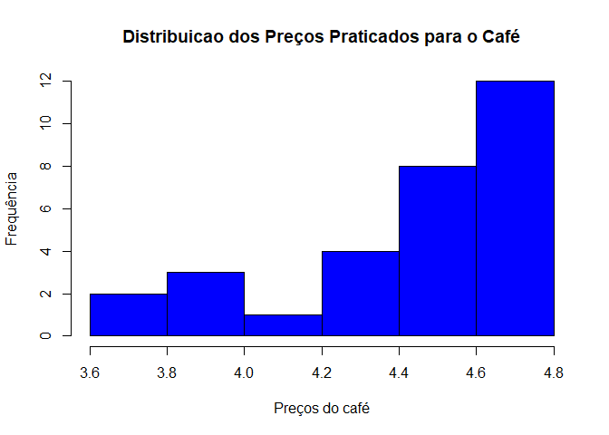<!-- -->

Agora, visualizaremos o histograma das três variáveis numéricas na mesma
página

``` r
par(mfrow=c(2,2)) #Configura layout para posicionar os graficos em duas linhas e duas colunas
hist(dados$Vendas_Cafe, col = 'black', main = 'Distribuicao das Vendas do Café', xlab="Vendas de café", ylab="Frequência")
hist(dados$Preco_Cafe, col = 'blue', main = 'Distribuicao dos Preços do Café', xlab="Preços do café", ylab="Frequência")
hist(dados$Preco_Leite, col = 'red', main = 'Distribuicao dos Preços do Leite', xlab="Preços do leite", ylab="Frequência")
```

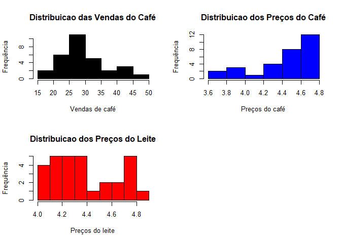<!-- -->

Visualiza relacao entre as vendas do café o preço do café

``` r
plot(y = dados$Vendas_Cafe,  x = dados$Preco_Cafe)
```

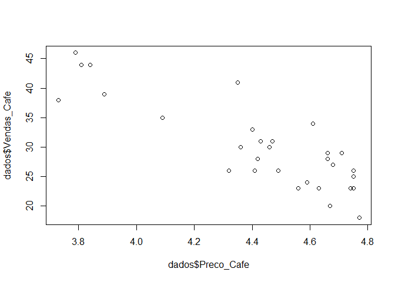<!-- -->

Customizando o gráfico anterior, temos:

``` r
plot(y = dados$Vendas_Cafe,
 x = dados$Preco_Cafe,
 pch = 16,
 col = 'blue',
 xlab = 'Preço',
 ylab = 'Quantidade Vendidade',
 main = 'Relação entre o Preço e as Vendas do Café')
grid() #este comando adiciona linhas de grade ao grafico
```

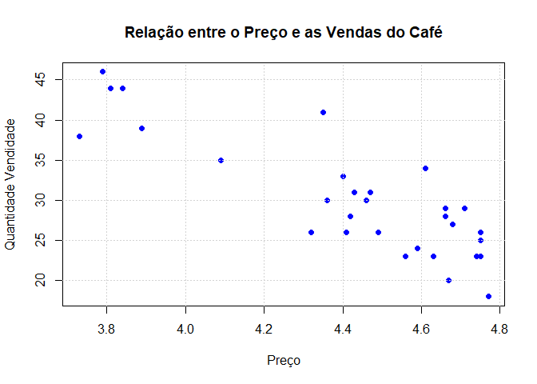<!-- -->

Agora, iremos colorir os pontos onde havia promoção naquele dia,
utilizando os dados categóricos da coluna Promocao para decidir.

``` r
plot(y = dados$Vendas_Cafe,
 x = dados$Preco_Cafe,
 col = factor(dados$Promocao), #aqui, temos que transformar os dados da coluna Promocao em um factor
 pch = 16,
 xlab = 'Preço',
 ylab = 'Quantidade Vendidade',
 main = 'Relação entre o Preço e as Vendas do Café')

#o trecho abaixo adiciona uma legenda no gráfico. o comando grid() adiciona as linhas pontilhadas no gráfico

legend(x=4.4,y=45,
 c("Promoção","Sem_Promoção"),
 col=c("red","black"),
 pch=c(16,16))
grid()
```

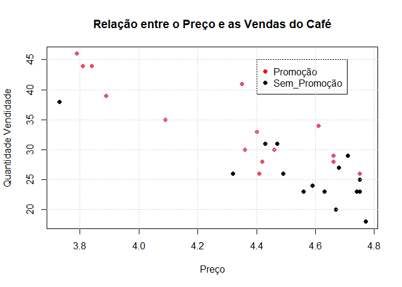<!-- -->

Criaremos uma nova variavel informando se naquele dia vendeu acima ou
abaixo da media historica.

``` r
media <- mean(dados$Vendas_Cafe) #armazena a media em uma variavel
variavel <- ifelse(dados$Vendas_Cafe > media, 'Acima_da_media', 'Abaixo_da_media')
variavel <- factor(variavel) #converte nova variavel para factor
plot(variavel) #grafico com a qtde abaixo e acima da media
```

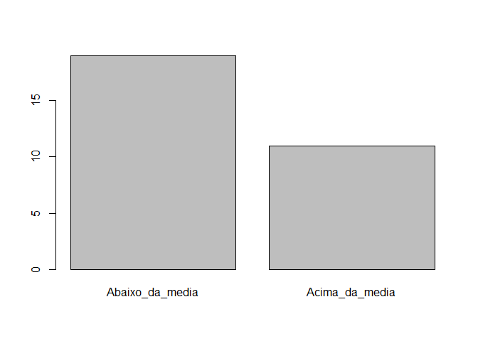<!-- -->

``` r
table(variavel) #visualiza a qtde abaixo e acima da media
```

    ## variavel
    ## Abaixo_da_media  Acima_da_media 
    ##              19              11

Geraremos os boxplots das colunas numéricas

``` r
par(mfrow=c(2,2)) #Configura layout para posicionar os graficos em duas linhas e duas colunas
#Gera boxplot das vendas
boxplot(dados$Vendas_Cafe, main="Vendas de café")

#Gera boxplot do preco
boxplot(dados$Preco_Cafe, main="Preço do café")


#Customizando o boxplot
boxplot(dados$Vendas_Cafe~dados$Promocao,
 col = 'gray', pch = 16,
 xlab = 'Promoção',
 ylab = 'Vendas',
 main = 'Vendas com promoção vs Vendas sem promoção')
```

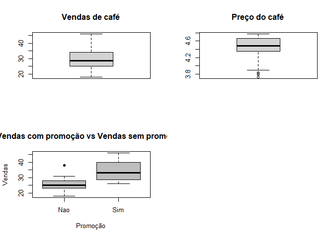<!-- -->
\# Capítulo 02 - Distribuições de Probabilidade

## DISTRIBUIÇÃO BINOMIAL

Exemplo: Definindo como sucesso o cliente comprar, e supondo que a
probabilidade de sucesso é 50%.Ao passar 10 clientes em nossa loja, qual
a probabilidade de realizarmos 2 vendas? Ou seja, queremos encontrar a
probabilidade de dois sucessos, em dez tentativas.Cuja probabilidade de
sucesso em cada tentativa é 50%

``` r
dbinom (x = 2, size = 10, prob = 0.5)
```

    ## [1] 0.04394531

Onde: x é o número de sucessos, size é o número de tentativas, prob é a
probabilidade de sucesso em cada tentativa

A função a seguir gera quantidades aleatórias de sucesso oriundos de uma
quantidade (size) de tentativas dada a probabilidade (prob) de sucesso.
É útil para realizar experimentos. Podemos simular qual a frequencia
esperada de vendas a cada dez clientes? Ainda mantendo a probabilidade
de sucesso (cliente comprar) de 50%.

``` r
va_binomial <- rbinom(n = 30, size=10, prob=0.5) 
```

Onde: n é a quantidade de vezes que o experimento deve ser repetido,
size é o número de tentativas a cada experimento, prob é o número de
sucesso em cada uma das tentativas

``` r
hist(va_binomial)
```

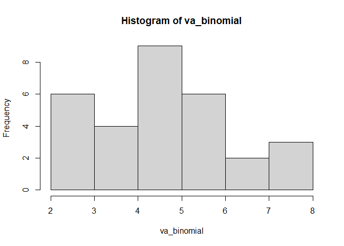<!-- -->

A maior barra no histograma representa a quantidade esperada de vendas.

Ajuste o parametro n para 1000 e plote o histograma e observe como a
distribuição binomial se aproxima da normal.

``` r
va_binomial <- rbinom(n = 1000, size=10, prob=0.5)
hist(va_binomial)
```

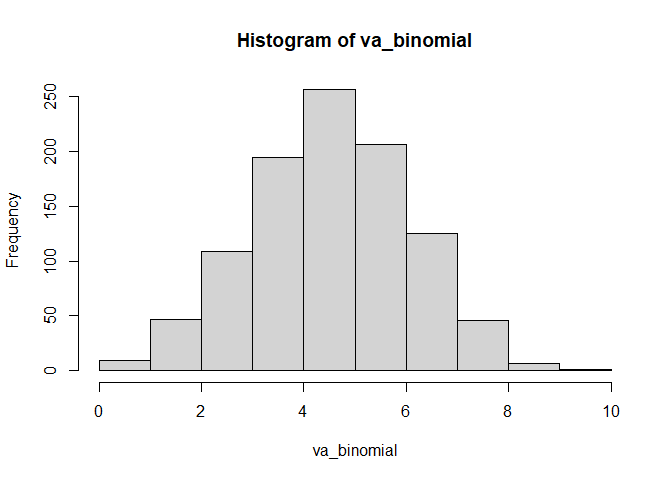<!-- -->

Podemos também querer a probabilidade de que até dois clientes comprem,
ao invés de saber a probabilidade de exatos dois comprarem. A
probabilidade de até dois clientes comprarem é:(probabilidade de nenhum
cliente comprar) + (probabilidade de um cliente comprar) +
(probabilidade de dois cliente comprarem). Formalizando: P(X&lt;=2) =
P(X=0) + P(X=1) + P(X=2)

``` r
pbinom(q = 2,size = 10, prob = 0.5)
```

    ## [1] 0.0546875

A probabilidade de que até dois clientes comprem ao entrarem dez
clientes, é de 5,48%

## DISTRIBUIÇÃO GEOMÉTRICA

Exemplo: Definindo como sucesso o cliente comprar, e supondo que a
probabilidade de sucesso é 50%.Qual a probabilidade da primeira venda
ocorrer quando o quinto cliente entrar na loja?

``` r
dgeom(x = 5, prob = 0.5)
```

    ## [1] 0.015625

Onde: x é o número de tentativas prob é a probabilidade de sucessos

Podemos utilizar a mesma função para nos dar a probabilidade do sucesso
ocorrer na primeira tentativa, segunda tentativa, terceira tentativa …
até a décima tentativa.

``` r
va_geometrica <- dgeom(x = 1:10, prob = 0.5)
va_geometrica
```

    ##  [1] 0.2500000000 0.1250000000 0.0625000000 0.0312500000 0.0156250000
    ##  [6] 0.0078125000 0.0039062500 0.0019531250 0.0009765625 0.0004882812

``` r
plot(va_geometrica)
```

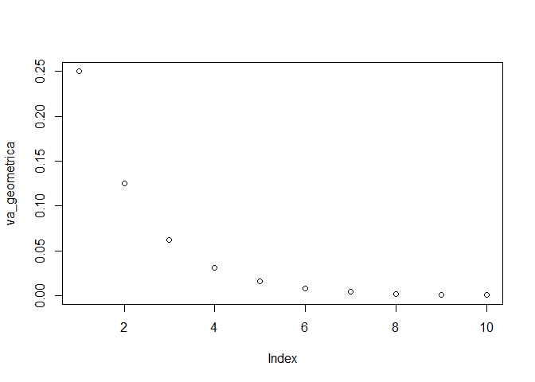<!-- -->

Veja como as probabilidades vão diminuindo. A probabilidade de sucesso
de 50% é relativamente alta, então é muito provavel que o sucesso ocorra
logo nas primeiras tentativas.

Podemos utilizar a distribuição geométrica acumulada para saber qual a
probabilidade do primeiro sucesso ocorrer na primeira tentativa OU na
segunda tentativa OU na terceira tentativa. Formalizando, queremos:
P(X&lt;=3)

``` r
va_geometrica_acumulada <- pgeom(0:3, prob = 0.5)
plot(va_geometrica_acumulada)
```

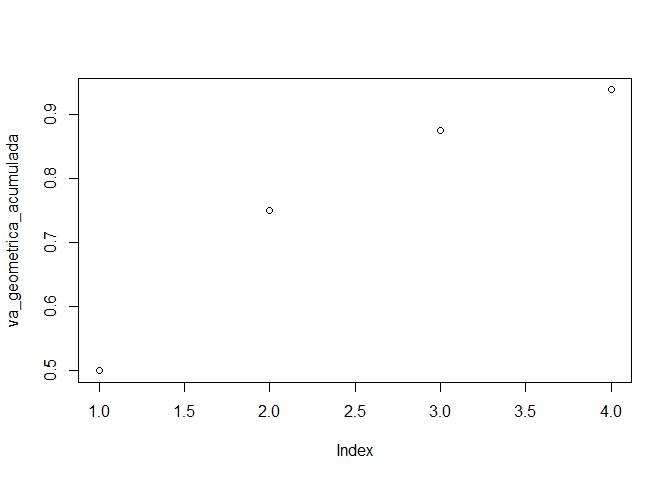<!-- -->

## DISTRIBUIÇÃO BINOMIAL NEGATIVA

Definindo como sucesso o cliente comprar, e supondo que a probabilidade
de sucesso é 50%.Qual a probabilidade de ter que entrar 8 clientes até
que a segunda venda ocorra?

``` r
dnbinom(x=2, size = 8, prob = 0.50) 
```

    ## [1] 0.03515625

Onde: x é o número de sucessos, size é a quantidade de tentativas, prob
é a probabilidade de sucesso

## DISTRIBUIÇÃO POISSON

Exemplo: Uma loja recebe em média, 6 (𝝺) clientes por minuto. Qual a
probabilidade de que 5(x) clientes entrem em um minuto?

``` r
dpois(x= 5,lambda = 6)
```

    ## [1] 0.1606231

Onde: x é a quantidade a ser testada, lambda é a taxa média de ocorrêcia
do evento em um determinado período de intervalo de tempo ou espaço.

Podemos utilizar a mesma funcao para obter a probabilidade de entrar um
cliente, dois clientes… quinze clientes

``` r
va_poison <- dpois(x = 1:15, lambda = 6)
plot(va_poison)
```

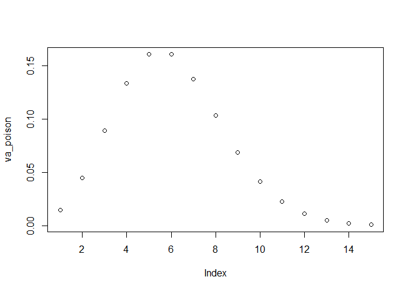<!-- -->

Observe que os valores se distribuiem simetricamente en tormo de seis,
isso acontece porque o parâmetro lambda é a média (e também o desvio
padrão) da distribuição de Poisson.

Também podemos obter a probabilidade acumulada de até 5 clientes
entrarem na loja em um minuto. Formalizando, queremos: P(X&lt;=5)

``` r
va_poison <- ppois(1:5, lambda = 6)
plot(va_poison)
```

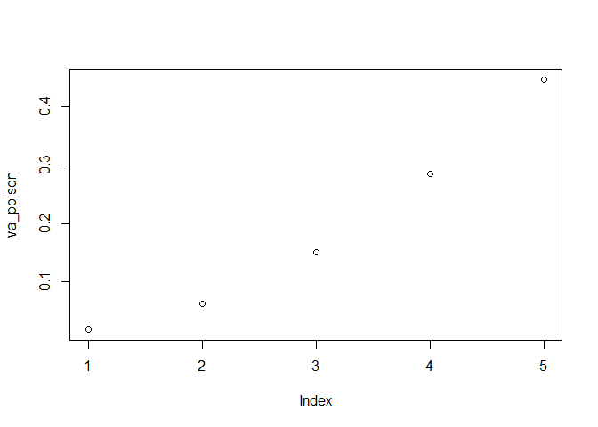<!-- -->

## DITRIBUIÇÃO NORMAL

Exemplo: Suponha que a distribuição dos salários dos funcionários de uma
empresa sigam uma distribuição normal com média 𝜇 = 2.500 e desvio
padrão σ = 170. Ao selecionar aleatoriamente um indivíduo dessa
população, qual a probabilidade de ter salário entre 2.400 e 2.600?
Precisamos achar a probabilidade do indivíduo ter um salário de até
2.600 e subtrair pela probabilidade do indivíduo ter o salário até
2.400.

Para P(X&lt;=2400):

``` r
probabilidade_ate_2400 <- pnorm(q = 2400, mean = 2500, sd = 170)
probabilidade_ate_2400
```

    ## [1] 0.2781872

e para P(X&lt;=2600)

``` r
probabilidade_ate_2600 <- pnorm(q = 2600, mean = 2500, sd =170 )
probabilidade_ate_2600
```

    ## [1] 0.7218128

determinando o intervalo P(X&lt;=2600) - P(X&lt;=2400), temos:

``` r
probabilidade_ate_2600 - probabilidade_ate_2400
```

    ## [1] 0.4436256

Podemos gerar 100 números aleatórios para uma distribuição normal com
média 2500 e desvio padrão 170

``` r
va_normal <- rnorm(n = 100, mean = 2500,sd = 170)
hist(va_normal)
```

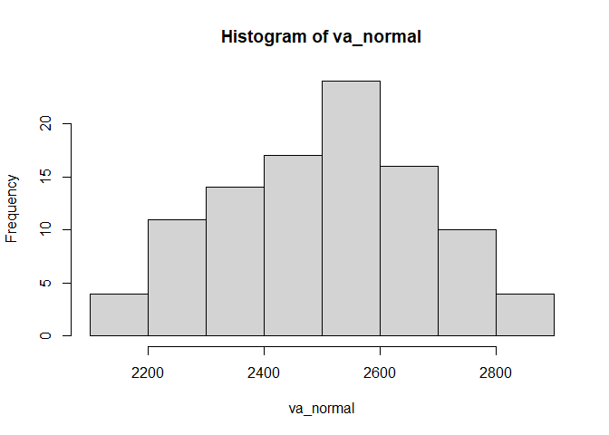<!-- -->

## DISTRIBUIÇÃO NORMAL PADRÃO

O comando scale() padroniza uma variável aleatória. Ao aplicar o comando
na variável va\_normal que acabmos de criar, ela ficará com média zero e
desvio padrão unitário

``` r
va_normal_padrao <- scale(va_normal)
hist(va_normal_padrao)
```

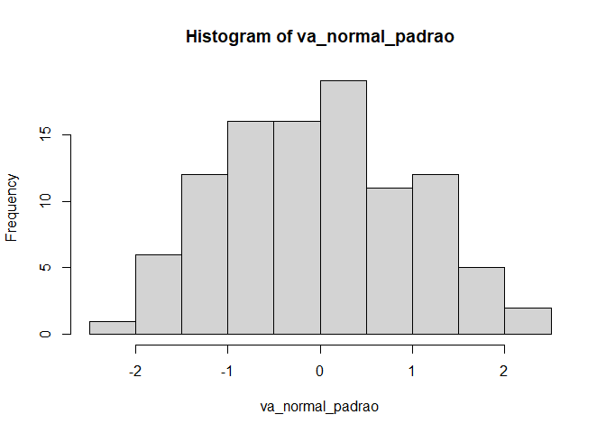<!-- -->

Exemplo: Suponha que a distribuição dos salários dos funcionários de uma
empresa sigam uma distribuição normal com média 𝜇 = 2.500 e desvio
padrão σ = 170. Ao selecionar aleatoriamente um indivíduo dessa
população, qual a probabilidade de ter salário acima de 2.600?

Padronização:

``` r
z <- (2600-2500)/170
pnorm(z, mean = 0, sd = 1)
```

    ## [1] 0.7218128

ou simplesmente

``` r
pnorm(z)
```

    ## [1] 0.7218128

Podemos também visualizar onde está o nosso valor Z em relação a média

``` r
plot(density(scale(va_normal))) #Plota curva de densidade
abline(v = 0,col = 'blue') #Gera uma linha sobre média, que é zero pois padronizamos a distribuição
abline(v = 0.58,col = 'red') #Gera uma linha sobre o valor z obtido
```

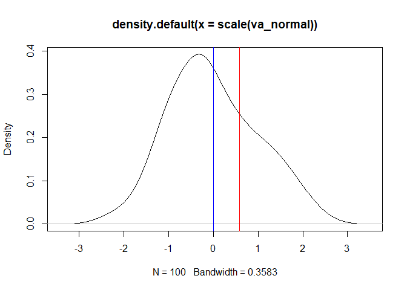<!-- -->

## DISTRIBUIÇÃO F

Gerando uma amostra aleatória de 1000 número seguindo uma distribuição F

``` r
va_f <- rf( n= 1000, df1 = 5 , df2 = 33 ) 
```

Onde: n é a quantidade de números a ser gerado, df1 é o primeiro grau de
liberidade, df2 é o segundo grau de liberdade.

Graficamente, temos:

``` r
hist(va_f)
```

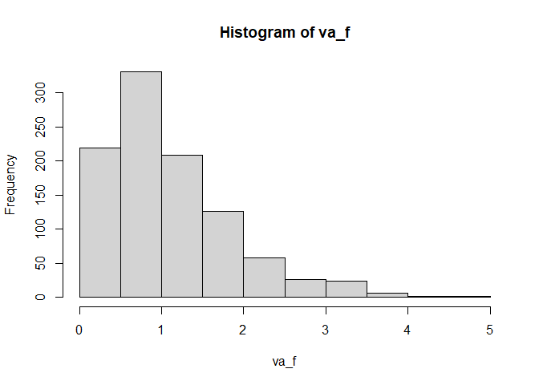<!-- -->

Vá aumentando os graus de liberdade e observe como a distribuição se
aproxima da normal

``` r
va_f <- rf( n= 1000, df1 = 30 , df2 = 66 )
hist(va_f)
```

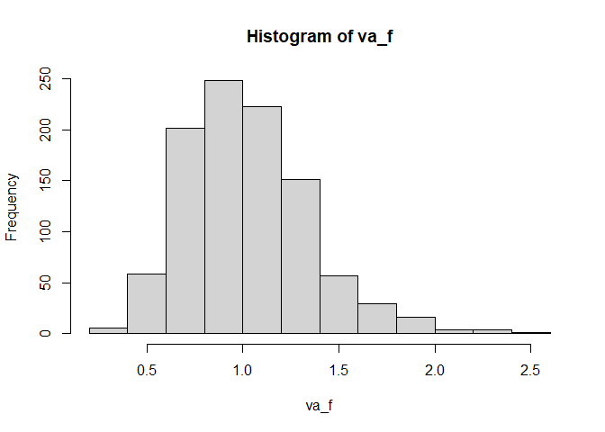<!-- -->
aumentando mais ainda

``` r
va_f <- rf( n= 1000, df1 = 60 , df2 = 120 )
hist(va_f)
```

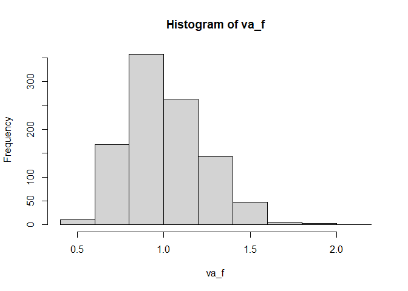<!-- -->

Informação Extra: Uma distribuição F é a razão entre duas chi-quadrado

## DISTRIBUIÇÃO T

Gera uma amostra aleatória de 1000 números seguindo uma distribuição T

``` r
va_t <- rt(1000, df = 2)
hist(va_t)
```

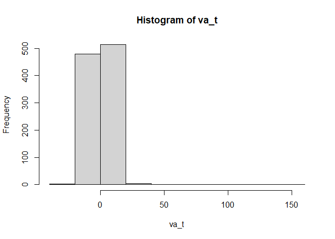<!-- -->

Observe que a distribuição t, assim como a normal padrão, é centrada no
zero. Vá aumentando o grau de liberdade e observando o comportamento do
histograma.

``` r
va_t <- rt(1000, df = 10)
hist(va_t)
```

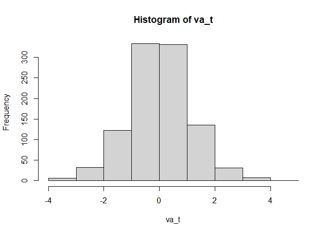<!-- -->
aumentando mais um pouco:

``` r
va_t <- rt(1000, df = 50)
hist(va_t)
```

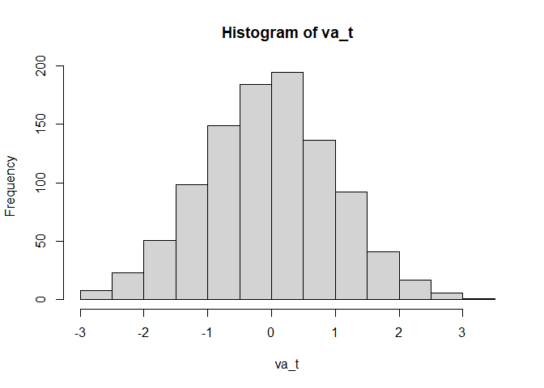<!-- -->

## DISTRIBUIÇÃO QUI-QUADRADO

Gera uma amostra aleatória de 1000 números seguindo uma distribuição
quiquadrado

``` r
va_QuiQuadrado <- rchisq(1000,df = 3)
hist(va_QuiQuadrado)
```

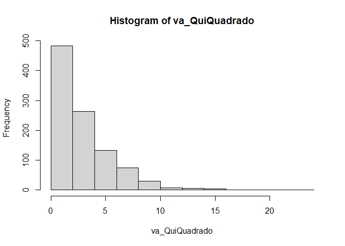<!-- -->

# Capítulo 03 - Intervalos de confiança

## Intervalo de confiança para média amostral pela distribuição Normal Padrão

Obter o intervalo de confiança para uma variável cuja média = 30, desvio
padrão = 7,31 e n = 30

Temos que definir o nível de confiança do nosso intervalo. Podemos obter
o valor do quantil para o nível de confiança desejado com a função
qnorm().

O quantil na distribuição normal padrão para 95% de confiança:

``` r
ic <- 0.95
alfa <- 1-ic
1-(alfa/2)
```

    ## [1] 0.975

``` r
qnorm(0.975)
```

    ## [1] 1.959964

Vamos armazenar os valores em objetos

``` r
media <- 30
desvio_padrao_populacional <- 7.31
n <- 30
quantil_95 <- qnorm(0.975)
```

Aplicando a fórmula:

``` r
Limite_Superior <- 30+quantil_95*(desvio_padrao_populacional/sqrt(n))
Limite_Inferior <- 30-quantil_95*(desvio_padrao_populacional/sqrt(n))
paste("Com 95% de confiança, podemos afirmar que a média varia entre",Limite_Inferior," e ",Limite_Superior)
```

    ## [1] "Com 95% de confiança, podemos afirmar que a média varia entre 27.3841981618855  e  32.6158018381145"

## Intervalo de confiança para a média amostral pela distribuição t de Student

A teoria nos diz para utilizar a distribuição t de Student quando não
soubermos o desvio padrão populacional.

Vamos assumir que o desvio padrão que temos é obtido a partir da amostra
e armazenar os valores em objetos:

``` r
media <- 30
desvio_padrao_amostral <- 7.31
n <- 30
quantil_95_t <- qt(0.975,df = n-1)
```

Aplicando a fórmula:

``` r
Limite_Superior_t <- 30+quantil_95_t*(desvio_padrao_amostral/sqrt(n))
Limite_Inferior_t <- 30-quantil_95_t*(desvio_padrao_amostral/sqrt(n))
paste("Com 95% de confiança, podemos afirmar que a média varia entre",Limite_Inferior_t," e ",Limite_Superior_t)
```

    ## [1] "Com 95% de confiança, podemos afirmar que a média varia entre 27.2704011402983  e  32.7295988597017"

Supondo que nossa variável já esteja em um data frame aqui no R, tem um
comando para fornecer o intervalo de confiança de forma bem mais fácil.

Vamos gerar com o comando rnorm() uma variável aleatoria com média 30,
desvio padrão 7,31 e n = 30 e vizualizar seu padrão:

``` r
va <- rnorm(n = 30, mean = 30, sd = 7.31)
hist(va)
```

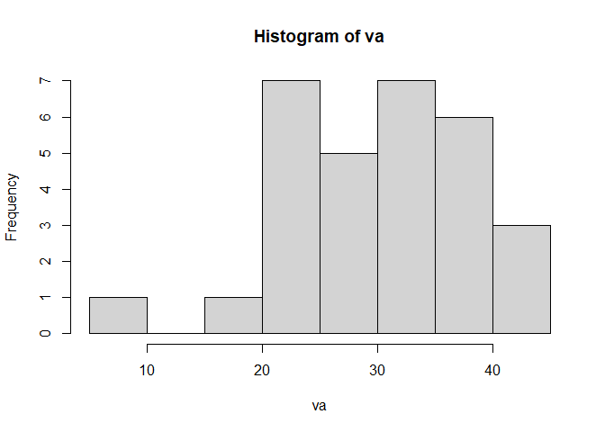<!-- -->

Calculando o intervalo de 95% de confiança com a distribuição t de
Student com a funçao t.test():

``` r
IC <-t.test(va, conf.level = 0.95)
IC$conf.int
```

    ## [1] 27.02330 32.50328
    ## attr(,"conf.level")
    ## [1] 0.95

Pronto, já temos o intervalo de confiança para média. Beeem mais fácil
assim :)

## Intervalo de confiança para a proporção

Utilizando o exemplo da apostila, onde calculamos o intervalo para
proporção onde 138 de n = 500 clientes realizaram a devolução do
produto.

Vamos armazenar os valores em objetos:

``` r
devolucoes <- 138
n <- 500
quantil_95 <-qnorm(0.975)
proporcao_devolucoes <- devolucoes/n
```

Aplicando a fórmula, temos:

``` r
Limite_Superior_prop <- proporcao_devolucoes + quantil_95 * sqrt(proporcao_devolucoes*(1-proporcao_devolucoes)/n)
Limite_Inferior_prop <- proporcao_devolucoes - quantil_95 * sqrt(proporcao_devolucoes*(1-proporcao_devolucoes)/n)
paste("Com 95% de confiança, podemos afirmar que a proporção varia entre",Limite_Inferior_prop," e ",Limite_Superior_prop)
```

    ## [1] "Com 95% de confiança, podemos afirmar que a proporção varia entre 0.236817971788424  e  0.315182028211576"

Podemos obter o intervalo de confiança para proporção mais fácil pela
função prop.test()

``` r
IC_proporcao <- prop.test(x = 138, n = 500, conf.level = 0.95)
IC_proporcao$conf.int
```

    ## [1] 0.2376893 0.3178132
    ## attr(,"conf.level")
    ## [1] 0.95

## Intervalo de confiança para média via Bootstrap

Vamos gerar uma va seguindo uma distribuição qui-quadrado

``` r
va <- rchisq(n = 60, df = 3)
hist(va)
```

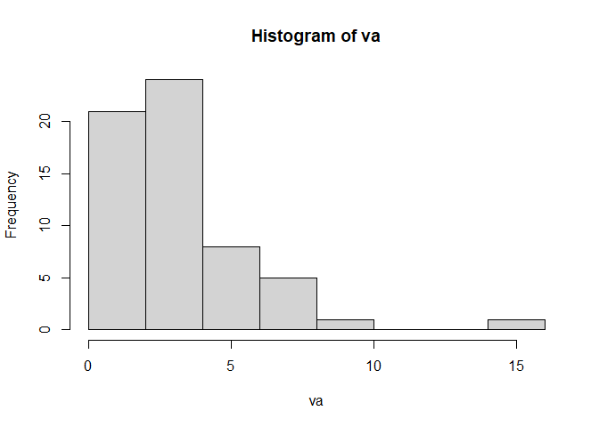<!-- -->

Inicializa variaveis

``` r
medias <- c() #Essa variável é um vetor para armazenar a média de cada subamostra bootstrap
R <- 1000 #Numero de subamostras extraídas para gerar a distribuição amostral de médias
```

Fazendo o bootstrap:

``` r
for (i in 1:R) {
 #Realiza uma subamostragem aleatória com reposição da va
reamostra <- sample(va, size = 50, replace = T)
 #Armazena a média da subamostra
 medias[i] <- mean(reamostra)
}
```

Distribuicao das médias das subamostras (distribuição amostral da média
da va)

``` r
hist(medias)
```

<!-- -->

Observe que mesmo a variável original não seguindo uma distribuição
normal, o Teorema Central do Limite nos garante que a distribuição das
médias será normal se n é suficientemente grande.

A partir das médias geradas, precisamos achar dois valores, o que corta
a cauda inferior e o que corta a cauda superior da distribuição.
Lembrando que ela é simétrica

Caso o intervalo desejado seja de 95% de confiança, temos que ordenar
essa distribuição do menor valor para o maior e achar o valor que
deixará 2,5% dos dados para trás e o valor que deixará 97,5% para trás:

``` r
(1-0.95)/2
```

    ## [1] 0.025

``` r
1-(1-0.95)/2
```

    ## [1] 0.975

Visualize o intervalo de confiança via bootstrap

``` r
quantile(medias, probs = c(0.025,0.975))
```

    ##     2.5%    97.5% 
    ## 2.507188 3.953352

Vamos realizar mais um experimento: Geraremos uma va com média = 30 e
desvio padrão amostral =7.31 e n = 30

``` r
va <- rnorm(n = 30, mean = 30, sd = 7.31)
```

Iremos calcular o intervalo de confiança usando o Bootstrap e também com
a distribuição \# t de Student. Compararemos os resultados.

Inicializa variavel para armazenar as médias de cada subamostra, e
realiza o bootstrap:

``` r
medias <- c()
R <- 10000
for (i in 1:R) {
 #Realiza uma subamostragem aleatória com reposição da va
 reamostra <- sample(va, size = 20, replace = T)
 #Armazena a média da subamostra
 medias[i] <- mean(reamostra)
}
#Distribuicao das médias das subamostras (distribuição amostral da média da va)
hist(medias)
```

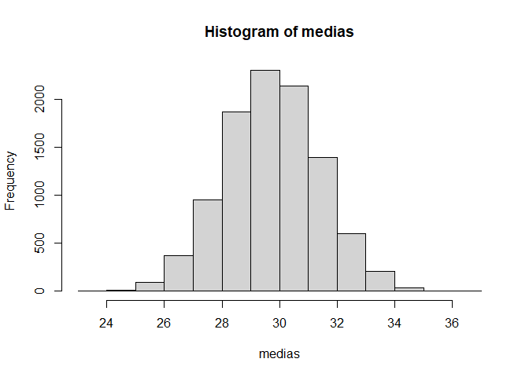<!-- -->

Limites inferior e superior do intervalo pelo bootstrap

``` r
quantile( medias, probs = c(0.025,0.975))
```

    ##     2.5%    97.5% 
    ## 26.52833 32.98991

Limites inferior e superior do intervalo via t de Student

``` r
IC<-t.test(va, conf.level = 0.95)
IC$conf.int
```

    ## [1] 26.94817 32.51941
    ## attr(,"conf.level")
    ## [1] 0.95

# Capítulo 04 - Testes de Hipóteses

## Avaliando a normalidade de uma variável aleatória

Gera a variável aleatória que segue distribuição normal com n = 70,
média = 40 e desvio padrão = 8

``` r
set.seed(10)
va_normal <- rnorm(n = 70, mean = 25, sd = 8)
```

Gera v.a. que segue uma distribuição F (não normal) com n = 15, 2 graus
de liberdade no numerados e 10 graus de liberdade no denominador

``` r
va_nao_normal <- rf(n =15, df1 =2, df2 = 10)
```

Visualize o histograma das variáveis geradas. Observe como os dados se
distribuem em torno do valor médio na va normal

``` r
hist(va_normal)
```

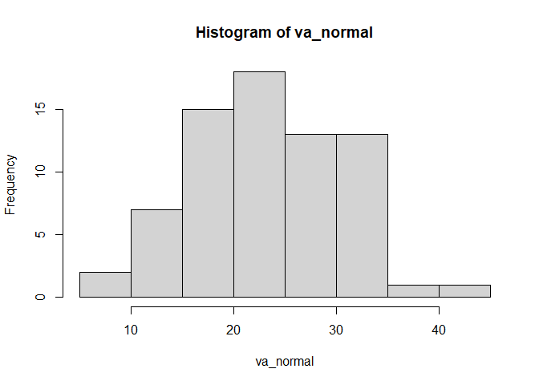<!-- -->

Observe como os dados não se distribuem em torno de um valor médio
exibindo padrão assimétrico

``` r
hist(va_nao_normal)
```

<!-- -->

Visualize o QQ-Plot. Observe como os pontos de dados seguem a linha reta
qq norm da va normal

``` r
qqnorm(va_normal)
qqline(va_normal) #Este comando é para adicionar a linha
```

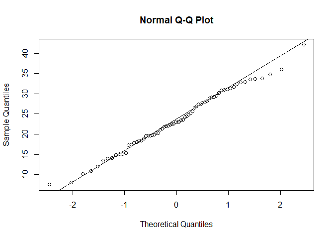<!-- -->

Observe como os pontos de dados não seguem a linha reta na va não normal

``` r
qqnorm(va_nao_normal)
qqline(va_nao_normal) #Este comando é para adicionar a linha
```

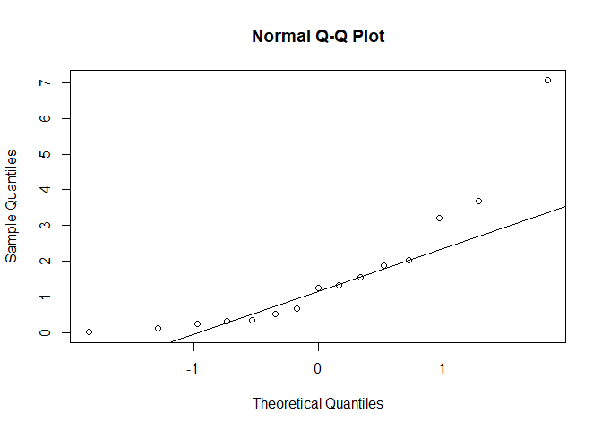<!-- -->

Vamos aplicar o teste de hipóteses Shapiro Wilk. O teste funciona sob as
hipóteses H0: A variável segue uma distribuição normal H1: A variável
não segue uma distribuição normal

Fixe um nível de significância alfa e analise o p valor (p-value) do
Shapiro Wilk. Se o p-value for menor que alfa a hipótese nula deve ser
rejeitada

``` r
shapiro.test(va_normal)
```

    ## 
    ##  Shapiro-Wilk normality test
    ## 
    ## data:  va_normal
    ## W = 0.99041, p-value = 0.8742

``` r
shapiro.test(va_nao_normal)
```

    ## 
    ##  Shapiro-Wilk normality test
    ## 
    ## data:  va_nao_normal
    ## W = 0.78348, p-value = 0.002274

## Teste t para diferença de médias (duas amostras independentes)

Iremos simular o exemplo da apostila. Iremos testar se: H0: As vendas na
posição A são iguais as Vendas na Posição B H1: As vendas na posição A
são diferentes das vendas na posição B

``` r
mu1 <- 150.1 #Armazena as média de vendas na posição A
mu2 <- 182.1 #Armazena as média de vendas na posição B

s1 <- 17 #Armazena o desvio padrão das vendas na posição A
s2 <- 19.2 #Armazena o desvio padrão das vendas na posição B

n1 <- 25 #Armazena a quantidade observações registradas para de vendas na posição A
n2 <- 30 #Armazena a quantidade observações registradas para de vendas na posição B
```

Calcula nossa estatística de teste. Que é o t calculado:

``` r
t <- (mu1 - mu2) / sqrt( s1^2/n1 + s2^2/n2)
t #Visualize o valor de t calculado
```

    ## [1] -6.552756

Calcula os graus de liberdade da estatística de teste

``` r
gl <- (s1^2/n1 + s2^2/n2)^2 /( (s1^2/n1)^2 / (n1-1) + (s2^2/n2)^2 / (n2-1) )
gl #Visualize a quantidade de graus de liberdade
```

    ## [1] 52.78313

Obtem o quantil (t crítico) para uma distribuição t com gl graus de
liberdade. A um alfa de 5%

``` r
quantil <- qt(0.975,df = gl)
quantil #Visualize o t crítico
```

    ## [1] 2.005938

Esse é o aspecto de uma distribuição t com n=53 observações e com n - 1
graus de liberdade

Observe onde estão os valores críticos que acabamos de encontrar

``` r
plot(density(rt(n = 53,df = gl)),xlim = c(-7,7)) 
abline(v = quantil,col = 'blue',lwd = 2)
abline(v = -quantil,col = 'blue',lwd = 2)
abline(v = t, col = 'red')# Observe como o tcalculado é muito menor que o tcrítico. Está na região de rejeição
```

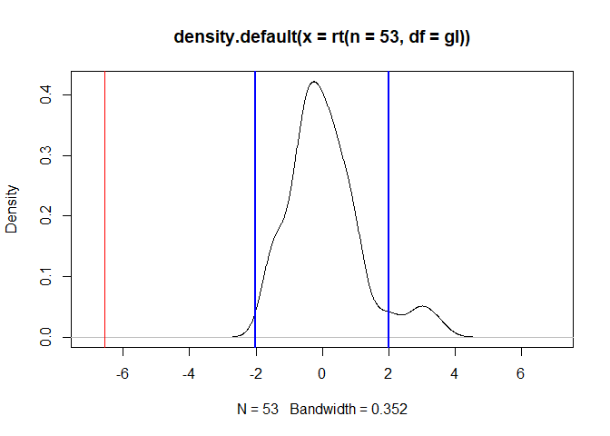<!-- -->

Obtendo o valor p

P(Tcalculado &gt; Tcritico)

``` r
2*pt(q = t, df = gl)
```

    ## [1] 2.403372e-08

Agora vamos realizar o mesmo teste de hipótese utilizando a função
nativa do R, **t.test()**

Observe no output desta função, que ela já nos da tudo pronto, t
calculado e valor p

``` r
vendas_A <- rnorm(n= 25, mean = 150.1, sd = 17)
vendas_B <- rnorm(n = 30, mean = 182.1, sd = 19.2)
t.test(vendas_A,vendas_B, alternative = 'two.sided')
```

    ## 
    ##  Welch Two Sample t-test
    ## 
    ## data:  vendas_A and vendas_B
    ## t = -5.8545, df = 49.638, p-value = 3.764e-07
    ## alternative hypothesis: true difference in means is not equal to 0
    ## 95 percent confidence interval:
    ##  -48.84840 -23.88916
    ## sample estimates:
    ## mean of x mean of y 
    ##  150.5147  186.8835

Esse é o aspecto de uma distribuição t com n observações e com n - 1
graus de liberdade

``` r
n <- 5
plot(density(rt(n = n,df = n-1))) 
```

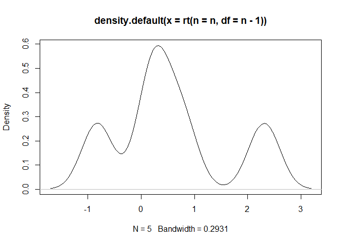<!-- -->

Altere o valor de n de 5 em 5 observe que a medida que os graus de
liberdade aumenta a distribuição se aproxima da normal. Como os valores
são geradosa leatoriamente poderemos ter curvas diferentes para um mesmo
valor de n, mas a medida que n cresce o comportamento simétrico tende a
estabilizar

``` r
n <- 10
plot(density(rt(n = n,df = n-1))) 
```

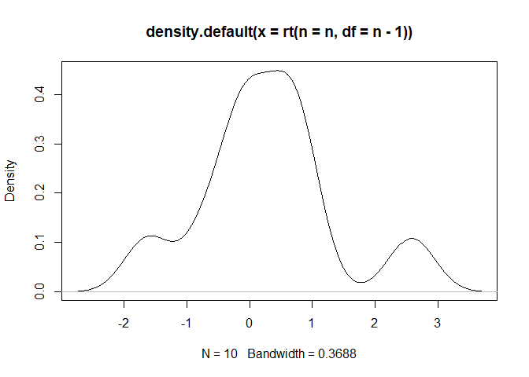<!-- -->

``` r
n <- 15
plot(density(rt(n = n,df = n-1))) 
```

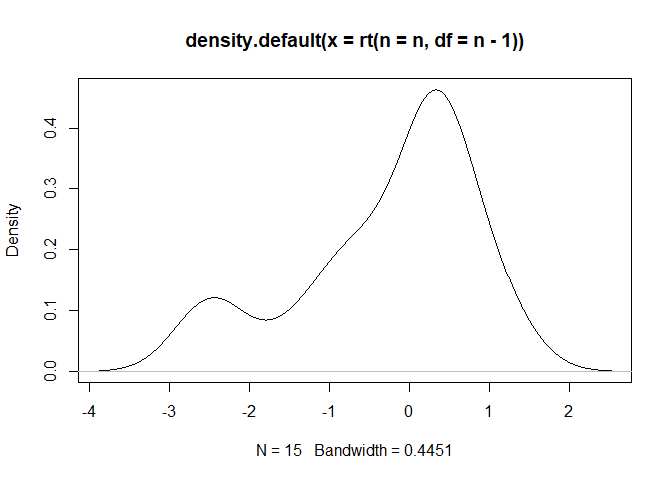<!-- -->

## Teste t para diferença de médias (duas amostras dependentes)

Iremos simular o exemplo da apostila: H0: O peso médio após a dieta é
igual ao peso médio antes da dieta H1: O peso médio após a dieta é menor
do que o peso médio antes da dieta

Iremos utilizar uma biblioteca adicional para gerar valores aleatórios
que sigam uma distribuição normal entre um intervalo de valor para
simular os pesos

A biblioteca chama ‘truncnorm’. Basta instalar com o comando abaixo
**install.packages()**.

Uma vez instalada não há mais necessidade de instalar novamente. Basta
carregar com o comando **library()**

``` r
#install.packages('truncnorm')
library(truncnorm)
set.seed(100)
```

Gera uma amostra aleatória, seguindo uma distribuição normal cujo valor
mínimo é 100 e o valor máximo é 140.

O valor de n=20, média = 123 e desvio padrão 18

Com essa v.a. iremos simular os pesos dos indivíduos antes da dieta

``` r
antes_da_dieta <- rtruncnorm(n=20, a=100, b=140, mean=123, sd=18)
```

Gera uma amostra aleatória, seguindo uma distribuição normal cujo valor
mínimo é 110 e o valor máximo é 130.

O valor de n=20, média = 110 e desvio padrão 28

Com essa v.a. iremos simular os pesos dos indivíduos após a dieta

``` r
depois_da_dieta <- rtruncnorm(n=20, a=110, b=130, mean=110, sd=28)
```

Calcula e visualiza a diferença depois da dieta e antes da dieta, para
cada indivíduo

``` r
diferenca <- depois_da_dieta-antes_da_dieta
hist(diferenca)
```

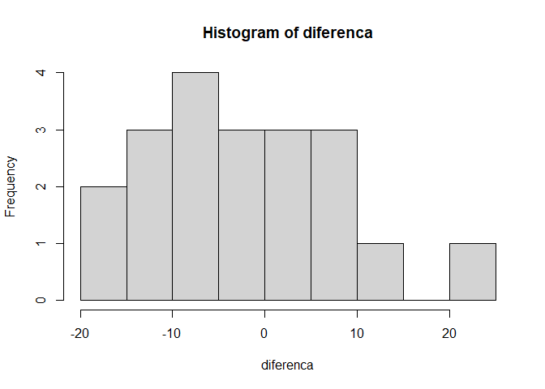<!-- -->

Avalie a normalidade da distribuição da diferença

``` r
shapiro.test(diferenca)
```

    ## 
    ##  Shapiro-Wilk normality test
    ## 
    ## data:  diferenca
    ## W = 0.9697, p-value = 0.7485

Aplica test t com os seguintes argumentos

``` r
t.test(depois_da_dieta,antes_da_dieta,
 paired = TRUE, #Pareado
 alternative = "less", #Unilateral a esquerda
 conf.level = 0.9 #90 porcento de confiança
 ) 
```

    ## 
    ##  Paired t-test
    ## 
    ## data:  depois_da_dieta and antes_da_dieta
    ## t = -0.95449, df = 19, p-value = 0.1759
    ## alternative hypothesis: true difference in means is less than 0
    ## 90 percent confidence interval:
    ##       -Inf 0.8496348
    ## sample estimates:
    ## mean of the differences 
    ##               -2.172799

O comando **t.test()** acima nos da tudo que precisamos para executar e
concluir o teste. Mas a título de conhecimento, podemos realizar o teste
passo a passo:

``` r
#Calcula a média das diferenças
media <- mean(diferenca)

#Desvio padrão das diferenças
desvio_padrao <- sd(diferenca)

#Quantidade de indivíduos
n <- 20

#Obtem o t calculado
t_calculado <- media / (desvio_padrao/sqrt(n))

#Obtem o valor p para o t calculado com n - 1 graus de liberdade.
pt(q = t_calculado, df = n-1) 
```

    ## [1] 0.1759111

Podemos também obter o t crítico para uma distribuição t com 19 (n-1 =
20-1) graus de liberdade ao nível de confiança de 90%

``` r
tcrítico_teste_t_pareado <- -qt(p = 0.9, df = 19) #Devido ao teste ser unilateral a esquerda a distribuição t ser simétrica, nossa estatística de teste será negativa
```

Observe que o t calculado é maior que o t critico. Como estamos em um
teste unilateral a esquerda o t calculado estará fora da região de
rejeição caso seja maior que o t crítico

``` r
t_calculado < tcrítico_teste_t_pareado
```

    ## [1] FALSE

## Teste Qui-Quadrado para associação entre variáveis categóricas

Iremos simular o exemplo da apostila H0: O fato do cliente estar ou não
com criança não tem relação com o fato de comprar ou não comprar H1: O
fato do cliente estar ou não com criança tem relação com fato de comprar
ou não comprar

Vamos gerar um data frame contendo os dados da pesquisa:

``` r
dados <- data.frame(Cliente = c("Adulto_com_Crianca", "Adulto_com_Crianca", "Adulto_com_Crianca",
 "Adulto", "Adulto", "Adulto", "Adulto_com_Crianca", "Adulto_com_Crianca",
 "Adulto_com_Crianca", "Adulto_com_Crianca", "Adulto_com_Crianca",
 "Adulto_com_Crianca", "Adulto_com_Crianca", "Adulto_com_Crianca",
 "Adulto_com_Crianca", "Adulto_com_Crianca", "Adulto_com_Crianca",
 "Adulto_com_Crianca", "Adulto_com_Crianca", "Adulto_com_Crianca",
 "Adulto_com_Crianca", "Adulto_com_Crianca", "Adulto_com_Crianca",
 "Adulto_com_Crianca", "Adulto", "Adulto", "Adulto", "Adulto",
 "Adulto_com_Crianca", "Adulto_com_Crianca", "Adulto_com_Crianca",
 "Adulto_com_Crianca", "Adulto", "Adulto_com_Crianca", "Adulto",
 "Adulto", "Adulto_com_Crianca", "Adulto_com_Crianca", "Adulto_com_Crianca",
 "Adulto", "Adulto_com_Crianca", "Adulto", "Adulto", "Adulto",
 "Adulto","Adulto","Adulto","Adulto","Adulto","Adulto"),

  Comprou = c("Não_Comprou", "Não_Comprou", "Não_Comprou", "Não_Comprou",
 "Não_Comprou", "Não_Comprou", "Comprou", "Comprou", "Comprou",
 "Comprou", "Comprou", "Comprou", "Comprou", "Comprou", "Comprou",
 "Comprou", "Comprou", "Comprou", "Comprou", "Comprou", "Comprou","Comprou", "Comprou", "Comprou", "Não_Comprou", "Não_Comprou",
 "Não_Comprou", "Não_Comprou", "Comprou", "Não_Comprou", "Comprou",
 "Comprou", "Não_Comprou", "Não_Comprou", "Não_Comprou",
"Não_Comprou",
 "Não_Comprou", "Comprou", "Comprou", "Não_Comprou", "Não_Comprou",
 "Não_Comprou", "Não_Comprou", "Não_Comprou",
"Comprou","Comprou","Comprou","Comprou","Comprou","Comprou")
)
```

Visualizando o conjunto de dados:

``` r
View(dados)
```

Gera tabela de contigência 2x2

``` r
tabela <- table(dados$Cliente,dados$Comprou)
tabela
```

    ##                     
    ##                      Comprou Não_Comprou
    ##   Adulto                   6          14
    ##   Adulto_com_Crianca      23           7

Visualiza a tabela num gráfico de barras

``` r
barplot(tabela)
```

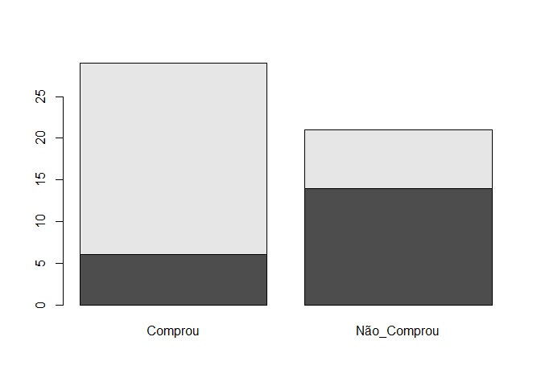<!-- -->

O valor crítico para uma distribuição qui-quadrado com (linhas-1) \*
(colunas-1) = 1 grau de liberdade ao nível de confiança de 95%

``` r
qchisq(p=0.95,df = 1)
```

    ## [1] 3.841459

O valor p unilateral fica

``` r
1-pchisq(q=10.728,df=1)
```

    ## [1] 0.001055264

Mesmo que o nível de confiança fosse 99%, ainda teríamos evidências para
rejeitar H0

Assim como fizemos no test t, podemos usar um comando direto no R para
realizar o teste qui-quadrado **chisq.test()**

``` r
teste<-chisq.test(tabela,correct = F)
teste
```

    ## 
    ##  Pearson's Chi-squared test
    ## 
    ## data:  tabela
    ## X-squared = 10.728, df = 1, p-value = 0.001055

Visualiza valores observados. Que nada mais é do que a tabela original

``` r
teste$observed
```

    ##                     
    ##                      Comprou Não_Comprou
    ##   Adulto                   6          14
    ##   Adulto_com_Crianca      23           7

Visualiza valores esperados

``` r
teste$expected
```

    ##                     
    ##                      Comprou Não_Comprou
    ##   Adulto                11.6         8.4
    ##   Adulto_com_Crianca    17.4        12.6

## ANOVA (Análise de Variância)

Vamos utilizar o exemplo da apostila: H0: Não há diferença no valor
médio gasto com bebidas em nenhuma das populações H1: Há diferença no
valor médio gasto com bebidas em pelo menos uma das populações

Geramos um data frame contendo os dados da pesquisa:

``` r
dados_anova <- data.frame(Gastos = c(174.770021661909, 161.329206619394,
 153.679900850863, 163.790338797433, 141.363480335882,
175.351592994046, 185.793398289321, 184.720273514352, 163.400459287948,
170.202462740626, 150.8549565713, 167.583106239899, 140.190492201897,
157.440088617225, 171.596654773339, 138.885665257324, 147.942698809323,
9.87474262516482, 50.5645554670016, 14.2586307887884, 8.5061846804934,
25.0875496696788, 17.0661987504312, 41.3867417301938, 20.8113941426179,
60.1224674502026, 35.5154028285664, 23.7622285692359, 34.6086119259266,
30.4321086925016, 27.8188980544904, 37.4729772794009, 30.7229538650678,
48.0452539322412, 78.9197865324734, 42.4926762466659, 8.81227865272712,
39.5751781629677, 37.1329656327517, 15.8016718071775, 5.74735216885902,
38.684069121093, 30.9398891106907, 34.7370783113952, 13.2630510987537,
19.6212096123791, 16.716945267481, 24.4037922212213, 4.63398786180773,
32.9436217626275, 21.511905851158, 31.4997283634204, 26.6610570873775,
34.6304034101472, 16.2704826042681, 11.2323425300881, 18.023244405391,
15.4790632095655, 8.25633422881043, 27.9053307974433, 72.3298402892867,
4.7263338963663, 14.4153129255327, 41.2234268777169, 50.5684226296565,
19.8344282661234, 8.81306901471397, 19.5112436004646, 55.6251926080436,
16.7592556127806, 20.3176176298076, 31.2073058210955, 17.0613250010048,
47.8590627884627, 2.59778754862417, 35.9470130480825, 2.39404093355522,
9.38425601777391, 25.2455048267186, 16.1960287769175, 43.530118783298,
32.7250288712979, 5.43268078364765, 44.5365791890593, 32.9831443965413,
28.2104605365607, 3.18609515001209, 14.3698142789208, 39.9617218607622,
50.564581262513, 10.4634451365926, 36.4842442182048, 13.1330189654278,
8.93702642184252, 12.1501174131844, 22.2552757873296, 15.1407470062459,
11.7525513477354, 16.2990775324815, 24.4627568806115, 2.87916580644454,
44.5453919973285, 38.0393535792355, 32.1985589022666, 0.357075783631849,
22.0703974352325, 50.7486034030794, 18.604230207709, 5.83122133978906,
19.9252025339318, 6.8366108202567, 27.5834177510951, 41.9303025963975,
3.077799353254, 28.0507001837521, 33.0042729903, 50.7366690908169,
30.1697285113061, 6.53184416916073, 7.53469171526227, 5.49225229796712,
9.53198727121377, 6.59266645551752, 19.8423174628847, 0.781567028951091,
22.1605754480815, 5.90830712162365, 54.3457453874529, 33.3341495203441,
37.2034845899045
), Estado_Civil = c("solteiros", "solteiros", "solteiros", "solteiros",
 "solteiros", "solteiros", "solteiros", "solteiros", "solteiros",
 "solteiros", "solteiros", "solteiros", "solteiros", "solteiros",
 "solteiros", "solteiros", "solteiros", "Casados", "Casados", "Casados", "Casados", "Casados", "Casados", "Casados", "Casados",
 "Casados", "Casados", "Casados", "Casados", "Casados", "Casados",
 "Casados", "Casados", "Casados", "Casados", "Casados", "Casados",
 "Casados", "Casados", "Casados", "Casados", "Casados", "Casados",
 "Casados", "Casados", "Casados", "Casados", "Casados", "Casados",
 "Casados", "Casados", "Casados", "Casados", "Casados", "Casados",
 "Casados", "Casados", "Casados", "Casados", "Casados", "Casados",
 "Casados", "Casados", "Casados", "Casados", "Casados", "Casados",
 "Casados", "Casados", "Casados", "Casados", "Casados", "Casados",
 "Casados", "Casados", "Casados", "Casados", "Casados", "Casados",
 "Casados", "Casados", "Casados", "Casados", "Casados", "Casados",
 "Casados", "Casados", "Casados", "Casados", "Casados", "Casados",
 "Casados", "Casados", "Casados", "Casados", "Casados", "Casados",
 "Casados", "Casados", "Casados", "Casados", "Casados", "Casados",
 "Casados", "Casados", "Casados", "Casados", "Casados", "Casados",
 "Casados", "Casados", "Casados", "Casados", "Casados", "Casados",
 "Divorciados", "Divorciados", "Divorciados", "Divorciados", "Divorciados",
 "Divorciados", "Divorciados", "Divorciados", "Divorciados", "Divorciados",
 "Divorciados", "Divorciados", "Divorciados", "Divorciados",
"Divorciados"))
```

Visualiza o conjunto de dados

``` r
View(dados_anova)
```

Podemos utilizar os recursos de visualização da biblioteca **ggplot2**
para visualizar a distribuição dos gastos nas populações

``` r
#install.packages("ggplot2")
library(ggplot2)
ggplot(data = dados_anova, aes(x = Gastos, fill = Estado_Civil)) +
 geom_density(alpha=0.4)+
 xlim(-50,300)
```

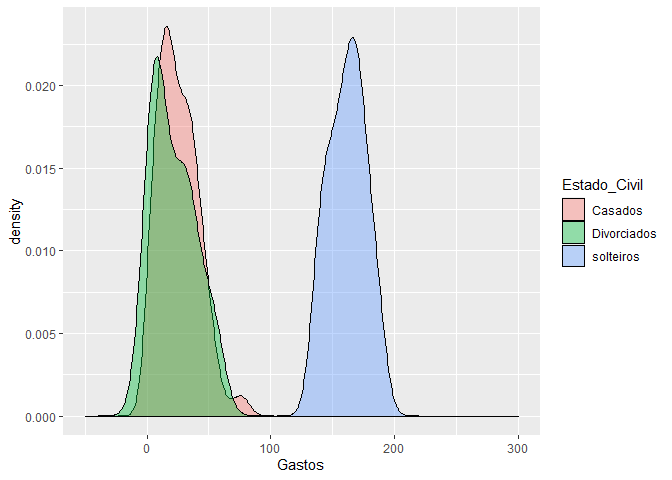<!-- -->

É bastante comum também analisarmos a variabilidade nas distintas
populações com uso de boxplot

``` r
boxplot(dados_anova$Gastos ~ dados_anova$Estado_Civil, ylab="Gastos", xlab="Estado Civil")
```

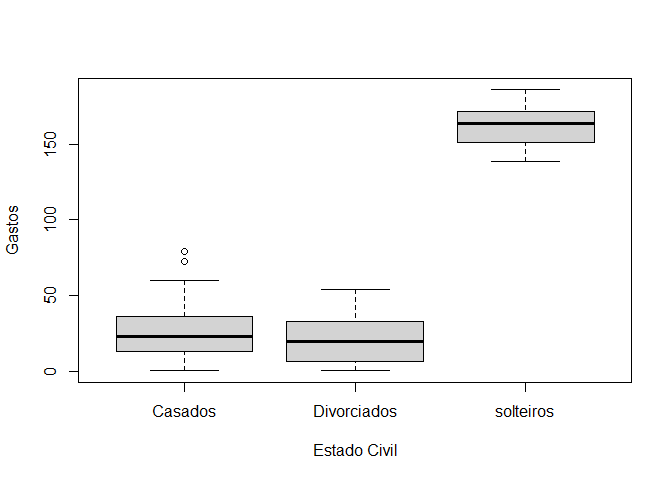<!-- -->

Com o comando **aov()**, o R gera a tabela da ANOVA completa

``` r
anova <- aov(Gastos~ #Variável resposta
 Estado_Civil, #Fator que queremos testar se exerce influencia na variável resposta
 data = dados_anova)
```

Visualize a tabela da ANOVA. Observe o F calculado e o valor p ( Pr &gt;
F)

``` r
summary(anova)
```

    ##               Df Sum Sq Mean Sq F value Pr(>F)    
    ## Estado_Civil   2 276639  138319   537.8 <2e-16 ***
    ## Residuals    127  32665     257                   
    ## ---
    ## Signif. codes:  0 '***' 0.001 '**' 0.01 '*' 0.05 '.' 0.1 ' ' 1

O valor p é praticamente zero. Mesmo que nosso nível de confiança fosse
99,9% ainda teríamos evidências para rejeitar H0

## Capítulo 05 - Regressão Linear

Instala e carrega biblioteca para gerar a curva ROC

``` r
#install.packages('pROC') #Instala
library("pROC") #Carrega
```

    ## Type 'citation("pROC")' for a citation.

    ## 
    ## Attaching package: 'pROC'

    ## The following objects are masked from 'package:stats':
    ## 
    ##     cov, smooth, var

Monte o dataset

``` r
dados <- data.frame(Prova_Logica = c(2, 2, 5, 5, 5, 2, 3, 2, 1, 4,  5, 8, 1, 1, 3, 4, 3, 2, 1, 1, 8, 8, 1, 2, 1, 5, 3, 3, 5, 4, 4, 1, 8, 3, 2, 3, 3, 2, 1, 1, 5, 4, 1, 5, 3, 1, 4, 6, 1, 1, 8, 1, 1, 5, 1, 5, 3, 1, 1, 8, 1, 1, 1, 1, 1, 2, 1, 5, 5, 4, 2, 1, 8, 4, 5, 1, 3, 3, 3, 5, 3, 1, 7, 1, 1, 2, 9, 5, 3, 1, 5, 1, 4, 2, 1, 4, 3, 3, 8, 1, 1, 8, 5, 1, 1, 1, 5, 8, 5, 1, 4, 2, 5, 4, 5, 3, 3, 5, 5, 5, 5, 5, 8, 5, 4, 9, 8, 1, 3, 4, 2, 5, 1, 4, 3, 5, 5, 5, 6, 4, 3, 5, 7, 1, 8, 5, 7, 3, 2, 3, 2, 5, 5, 5, 5, 4, 4, 8, 1, 1, 2, 5, 3, 2, 7, 4, 1, 1, 1, 4, 5, 1, 1, 8, 3, 6, 8, 3,1, 3, 3, 2, 8, 4, 1, 1, 1, 1, 1, 2, 3, 4, 6, 2, 3, 3, 4, 2, 1, 5, 2, 4, 3, 3, 1, 3, 3, 3, 1, 3, 5, 6, 1, 5, 1, 5, 4, 3, 1, 6, 1, 4, 9, 3, 3, 2, 1, 1, 4, 3, 1, 3, 1, 1, 3, 7, 8, 1, 3, 5, 6, 3, 6, 5, 8, 5, 1, 1, 4, 2, 1, 8, 7, 5, 1, 1, 1, 6, 5, 7, 3, 3, 5, 1, 3, 5, 1, 8, 8, 1, 2, 3, 3, 3, 3, 7, 1, 9, 8, 4, 1, 7, 1, 1, 1, 5, 1, 1, 5, 3, 5, 1, 3, 6, 2, 1, 3, 4, 5, 6, 1, 5, 1, 5, 1, 1, 5, 1, 1, 1, 5, 1, 3, 7, 1, 4, 3, 7, 1, 1, 5, 4, 1, 1, 3, 5, 4, 2, 1, 5, 1, 1, 1, 8, 8, 5, 1, 2, 1, 6, 8, 3, 1, 5, 1, 5, 1, 4, 4, 8, 1, 1, 1, 5, 1, 1, 5, 4, 6, 8, 1, 3, 1, 6, 1, 1, 1, 1, 1, 8, 1, 5, 3, 1, 4, 4, 7, 2, 3, 3, 5, 8, 3, 1, 4, 1, 5, 1, 7, 2, 6, 4, 1, 3, 1, 8, 5, 5, 5, 3, 1, 4, 5, 3, 6, 1, 3, 3, 5, 4, 5, 3, 1, 4, 5, 1, 3, 6, 1, 1, 1, 3, 1, 1, 1, 1, 3, 1, 5, 4, 8, 1, 5, 6, 6, 4, 2, 5, 5, 6, 1, 2, 5, 6, 4, 2, 1, 2, 7, 2, 8, 1, 3, 1, 1, 1, 6, 1, 4, 3, 1, 5, 2, 1, 1, 5, 4, 3, 1, 3, 1, 1, 2, 4, 5, 4, 5, 4, 3, 7, 4, 1, 7, 1, 8, 5, 3, 3, 5, 1, 2, 1, 5, 4, 4, 4, 3, 6, 8, 8, 1, 1, 1, 8, 8, 1, 5, 1, 4, 5, 1, 4, 1, 4, 1, 5, 1, 4, 4, 1, 1, 2, 5, 1, 4, 4, 5, 4, 1, 1, 5, 3, 5, 4, 1, 1, 5, 3, 3, 1, 5, 5, 4, 5, 7, 2, 5, 9, 4, 6, 1, 1, 1, 1, 8, 7, 2, 3, 2, 9, 3, 1, 5, 1, 3, 5, 1, 4, 6, 3, 1, 5, 1, 3, 9, 1, 4,
 8, 8, 1, 3, 2, 3, 3, 1, 5, 1, 1, 3, 1, 5, 3, 4, 3, 4, 1, 4, 3, 5, 1, 5, 2, 5, 8, 9, 4, 7, 4, 8, 5, 7, 5, 3, 5, 6, 3, 1, 5, 6, 4, 3, 5, 1, 2, 4, 1, 1, 2, 9, 5, 1, 5, 1, 2, 1, 5, 1, 2, 3, 5, 1, 1, 5, 3, 9, 5, 6, 9, 6, 1, 1, 9, 1, 3, 5, 4, 8, 4, 2, 7, 1, 6, 3, 7, 8, 1, 5, 5, 6, 1, 4, 4, 3, 1, 5, 5, 8, 3, 3, 1, 9, 5, 5, 5, 5, 1, 9, 6, 3, 1, 1, 2, 4, 6, 5, 7, 6, 5, 1), 
 
 Redacao = c(1, 1, 1, 4, 3, 3, 5, 5, 9, 1, 1, 1, 1, 1, 4, 3, 3, 1, 1, 1, 1, 7, 1, 1, 8, 1, 1, 1, 3, 8, 3, 1, 5, 3, 3, 1, 2, 7, 1, 1, 1, 1, 1, 1, 7, 1, 1, 8, 7, 1, 1, 1, 1, 1, 1, 1, 1, 1, 1, 1, 5, 1, 8, 5, 1, 1, 1, 1, 1, 2, 1, 1, 6, 1, 1, 1, 1, 1, 1, 1, 4, 1, 8, 5, 1, 5, 8, 1, 1, 1, 5, 1, 1, 1, 2, 3, 3, 1, 3, 8, 1, 4, 6, 1, 1, 1, 1, 3, 1, 1, 2, 3, 2, 1, 1, 1, 1, 4, 1, 1, 1, 1, 4, 1, 8, 1, 5, 1, 1, 1, 1, 1, 3, 6, 1, 2, 5, 6, 1, 2, 2, 1, 8, 1, 4, 6, 9, 3, 1, 1, 1, 1, 1, 1, 1, 1, 1, 7, 1, 1, 1, 1, 1, 1, 6, 1, 1, 1, 1, 1, 3, 5, 1, 1, 1, 1, 3, 1, 4, 1, 1, 1, 2, 1, 3, 1, 1, 1, 4, 5, 1, 1, 6, 1, 3, 1, 4, 1, 1, 1, 1, 1, 1, 1, 1, 1, 1, 1, 1, 2, 3, 6, 1, 8, 1, 1, 5, 1, 8, 2, 6, 1, 5, 1, 6, 1, 1, 1, 1, 1, 1, 1,1, 3, 1, 4, 8, 1, 1, 1, 8, 1, 3, 1, 6, 3, 1, 1, 1, 1, 1, 1, 1,1, 1, 1, 1, 1, 1, 5, 1, 1, 3, 1, 1, 7, 4, 1, 1, 1, 1, 6, 1, 3,1, 4, 1, 1, 7, 2, 6, 4, 1, 1, 1, 1, 1, 4, 7, 1, 3, 1, 1, 9, 1,1, 1, 1, 1, 1, 1, 3, 1, 3, 1, 3, 1, 1, 3, 2, 1, 1, 1, 5, 3, 1,1, 2, 1, 1, 4, 1, 1, 1, 1, 1, 1, 1, 1, 1, 1, 1, 4, 8, 1, 7, 1,1, 3, 8, 1, 1, 1, 1, 1, 4, 1, 1, 1, 2, 2, 7, 1, 3, 1, 1, 1, 4,2, 4, 2, 2, 5, 3, 1, 1, 1, 5, 1, 9, 1, 1, 3, 2, 1, 1, 5, 1, 2,1, 3, 8, 1, 5, 1, 4, 3, 1, 8, 1, 6, 5, 1, 1, 1, 1, 1, 4, 5, 1,7, 8, 1, 4, 1, 1, 1, 1, 4, 1, 1, 2, 1, 8, 2, 6, 2, 1, 4, 1, 1,1, 1, 1, 4, 1, 1, 1, 1, 1, 8, 1, 1, 1, 3, 1, 1, 1, 8, 1, 1, 1,3, 1, 1, 1, 1, 1, 6, 1, 1, 1, 1, 1, 4, 1, 1, 1, 1, 1, 1, 1, 1,3, 1, 2, 7, 2, 1, 1, 1, 1, 1, 2, 2, 1, 3, 1, 1, 3, 1, 1, 5, 1,7, 1, 1, 1, 3, 6, 1, 1, 1, 1, 1, 1, 1, 1, 4, 1, 6, 8, 8, 7, 2,1, 1, 1, 1, 1, 1, 1, 5, 1, 1, 5, 1, 1, 1, 1, 9, 1, 8, 1, 1, 2,4, 1, 1, 6, 2, 1, 1, 1, 1, 1, 1, 1, 1, 2, 1, 1, 1, 1, 6, 1, 2,1, 1, 5, 4, 1, 8, 4, 6, 6, 1, 1, 1, 9, 1, 1, 1, 1, 1, 8, 1, 1,1, 1, 1, 3, 1, 1, 4, 1, 1, 3, 4, 1, 1, 3, 2, 3, 1, 2, 1, 1, 1,1, 1, 1, 1, 1, 1, 1, 1, 1, 1, 1, 2, 3, 1, 4, 1, 4, 2, 1, 6, 1,
4, 2, 2, 1, 1, 1, 4, 1, 1, 1, 1, 1, 6, 1, 1, 1, 3, 2, 8, 1, 1,1, 1, 1, 2, 3, 1, 1, 1, 1, 1, 1, 6, 1, 6, 7, 1, 1, 5, 1, 2, 5,1, 1, 1, 1, 1, 2, 1, 3, 1, 1, 1, 8, 7, 1, 1, 1, 1, 4, 1, 6, 1,2, 8, 4, 7, 1, 1, 1, 5, 1, 1, 2, 1, 1, 7, 1, 1, 1, 4, 1, 1, 3,1, 5, 1, 7, 1), 

Auto_Avaliacao = c(1, 1, 1, 1, 1, 1, 1, 7, 1, 1, 1, 9, 1, 1, 1, 3, 6, 1, 1, 1, 1, 1, 1, 1, 1, 1, 1, 1, 1, 1, 1, 1, 3, 1, 1, 1, 1, 9, 1, 1, 1, 1, 1, 1, 8, 1, 1, 9, 7, 1, 2,
 1, 1, 1, 1, 1, 1, 1, 1, 7, 1, 3, 8, 1, 1, 1, 1, 1, 1, 6, 1, 1, 1, 2, 1, 1, 1, 1, 1, 1, 3, 1, 8, 3, 1, 6, 1, 6, 1, 1, 3, 1, 1,1, 1, 8, 5, 3, 3, 1, 1, 3, 1, 1, 1, 1, 1, 6, 1, 2, 1, 1, 1, 1, 1, 4, 1, 6, 1, 1, 1, 2, 3, 1, 4, 7, 6, 1, 1, 1, 1, 1, 1, 9, 1, 2, 1, 1, 1, 1, 2, 1, 8, 1, 8, 1, 3, 2, 1, 1, 1, 1, 2, 6, 1, 1, 1, 2, 1, 3, 1, 1, 8, 1, 4, 1, 1, 1, 1, 1, 1, 1, 1, 1, 1, 1, 9, 1, 5, 1, 1, 1, 1, 1, 5, 1, 1, 1, 3, 5, 1, 1, 1, 1, 1, 1, 3, 1, 1, 1, 1, 1, 1, 1, 1, 1, 1, 1, 1, 1, 3, 6, 1, 8, 1, 2, 5, 2, 1, 1, 7, 1, 1, 1, 8, 1, 1, 5, 1, 1, 1, 3, 1, 1, 1, 9, 1, 1, 1, 5, 9, 1, 5, 3, 4, 1, 1, 1, 1, 1, 1, 7, 1, 1, 1, 1, 3, 3, 1, 3, 1, 1, 1, 1, 1, 1, 3, 8, 1, 4, 1, 4, 1, 1, 1, 6, 1, 3, 1, 1, 2, 3, 1, 1, 1, 1, 1, 1, 1, 1, 9, 1, 1, 2, 2, 8, 1, 1, 1, 1, 1, 4, 1, 1, 1, 1, 1, 1, 2, 1, 1, 1, 1, 4, 3, 1, 1, 4, 1, 6, 2, 1, 5, 3, 1, 1, 2, 1, 1, 1, 1, 1, 1, 8, 3, 4, 8, 1, 3, 7, 7, 1, 1, 2, 1, 1, 1, 1, 1, 4, 1, 1, 1, 1, 1, 1, 1, 1, 1, 1, 1, 3, 9, 1, 1, 1, 1, 8, 1, 7, 1, 1, 1, 1, 1, 1, 1, 1, 2, 1, 1, 1, 2, 9, 6, 3, 3, 1, 2, 1, 8, 7, 1, 1, 1, 1, 1, 6, 3, 1, 4, 5, 1, 6, 1, 1, 1, 1, 3, 1, 1, 2, 1, 6, 3, 7, 1, 8, 3, 1, 1, 1, 1, 1, 1, 1, 1, 1, 1, 1, 8, 1, 1, 1, 9, 1, 1, 1, 7, 1, 1, 1, 1, 1, 1, 1, 1, 1, 1, 1, 1, 1, 1, 1, 3, 1, 1, 1, 1, 1, 1, 1, 1, 6, 1, 1, 1, 1, 1, 1, 2, 1, 1, 1, 2, 1, 7, 1, 1, 4, 2, 1, 5, 1, 5, 1, 1, 1, 4, 6, 1, 1, 4, 1, 2, 1, 1, 1, 9, 8, 1, 9, 1, 1, 1, 1, 1, 1, 1, 3, 1, 1, 1, 1, 1, 4, 1, 1, 1, 1, 7, 1, 1, 1, 1, 1, 3, 1, 1, 8, 1, 1, 6, 1, 1, 1, 2, 1, 1, 1, 1, 1, 1, 2, 5, 1, 6, 3, 1, 4, 3, 1, 7, 5, 1, 1, 1, 1, 1, 1, 2, 1, 5, 9, 1, 1, 1, 2, 1, 1, 1, 1, 3, 1, 8, 1, 1, 2, 5, 1, 1, 5, 1, 4, 1, 1, 1, 1, 1, 1, 1, 1, 1, 1, 1, 1, 1, 1, 1, 1, 1, 1, 1, 3, 1, 1, 3, 1, 5, 1, 8, 1, 1, 1, 1, 1, 1, 1, 1, 1, 1, 1, 6, 1, 1, 1, 2, 1, 1, 2, 1, 1, 1, 1, 2, 1, 1, 1, 1, 1, 1, 1, 6, 1, 9, 5, 3, 1, 8, 1, 1, 3, 1, 1, 1, 1, 1, 1, 1, 2, 1, 1, 1, 8, 1, 1, 1, 1, 1, 1, 1, 7, 1, 1, 1, 1, 1, 1, 1, 1, 1, 1, 1, 1, 1, 2, 8, 1, 1, 1, 6, 1, 1, 1, 1, 9, 1, 1, 1),

Classe = c("Ruim",  "Ruim", "Ruim", "Boa", "Ruim", "Ruim", "Boa", "Boa", "Boa", "Ruim",  "Ruim", "Boa", "Ruim", "Ruim", "Boa", "Ruim", "Ruim", "Ruim", "Ruim", "Ruim", "Boa", "Boa", "Ruim", "Ruim", "Boa", "Ruim",  "Ruim", "Ruim", "Boa", "Boa", "Ruim", "Ruim", "Boa", "Boa", "Ruim", "Ruim", "Ruim", "Boa", "Ruim", "Ruim", "Boa", "Ruim", "Ruim",  "Ruim", "Boa", "Ruim", "Ruim", "Boa", "Boa", "Ruim", "Boa", "Ruim", "Ruim", "Ruim", "Ruim", "Ruim", "Ruim", "Ruim", "Ruim", "Boa",  "Boa", "Boa", "Boa", "Boa", "Ruim", "Ruim", "Ruim", "Ruim", "Ruim", "Boa", "Ruim", "Boa", "Boa", "Ruim", "Ruim", "Ruim", "Ruim",  "Ruim", "Ruim", "Ruim", "Boa", "Ruim", "Boa", "Boa", "Ruim", "Boa", "Boa", "Boa", "Ruim", "Ruim", "Boa", "Ruim", "Ruim", "Ruim",  "Ruim", "Ruim", "Ruim", "Boa", "Boa", "Boa", "Ruim", "Ruim", "Boa", "Ruim", "Ruim", "Ruim", "Ruim", "Boa", "Boa", "Boa", "Ruim",  "Ruim", "Ruim", "Ruim", "Ruim", "Boa", "Ruim", "Ruim", "Ruim",  "Ruim", "Boa", "Ruim", "Boa", "Ruim", "Boa", "Boa", "Boa", "Ruim", "Ruim", "Boa", "Ruim", "Ruim", "Boa", "Ruim", "Ruim", "Ruim",  "Boa", "Boa", "Boa", "Ruim", "Ruim", "Ruim", "Boa", "Ruim", "Ruim", "Boa", "Boa", "Ruim", "Ruim", "Ruim", "Ruim", "Ruim", "Ruim",  "Boa", "Ruim", "Ruim", "Ruim", "Boa", "Ruim", "Ruim", "Ruim", "Ruim", "Ruim", "Ruim", "Boa", "Boa", "Ruim", "Ruim", "Ruim",  "Ruim", "Ruim", "Boa", "Boa", "Boa", "Ruim", "Boa", "Boa", "Ruim", "Boa", "Ruim", "Ruim", "Ruim", "Ruim", "Ruim", "Boa", "Ruim",  "Ruim", "Ruim", "Boa", "Boa", "Ruim", "Ruim", "Boa", "Ruim", "Ruim", "Ruim", "Ruim", "Ruim", "Ruim", "Ruim", "Ruim", "Ruim",  "Ruim", "Ruim", "Ruim", "Ruim", "Ruim", "Ruim", "Ruim", "Ruim", "Boa", "Boa", "Ruim", "Boa", "Ruim", "Ruim", "Boa", "Ruim", "Boa",  "Ruim", "Boa", "Ruim", "Boa", "Ruim", "Boa", "Ruim", "Ruim",
 "Boa", "Ruim", "Ruim", "Ruim", "Ruim", "Ruim", "Boa", "Ruim",  "Boa", "Boa", "Ruim", "Ruim", "Boa", "Boa", "Ruim", "Ruim", "Ruim", "Boa", "Ruim", "Ruim", "Ruim", "Ruim", "Ruim", "Ruim", "Boa",  "Ruim", "Ruim", "Ruim", "Ruim", "Ruim", "Boa", "Ruim", "Boa", "Ruim", "Ruim", "Boa", "Ruim", "Ruim", "Boa", "Boa", "Boa", "Boa", "Boa", "Ruim", "Boa", "Ruim", "Ruim", "Ruim", "Boa", "Ruim", "Boa", "Boa", "Ruim", "Boa", "Boa", "Ruim", "Ruim", "Ruim", "Ruim", "Ruim", "Boa", "Boa", "Ruim", "Boa", "Ruim", "Ruim", "Ruim", "Ruim", "Boa", "Ruim", "Ruim", "Ruim", "Boa", "Boa", "Boa", "Ruim", "Ruim", "Ruim", "Boa", "Ruim", "Ruim", "Ruim", "Ruim", "Ruim", "Ruim", "Ruim", "Boa", "Ruim", "Ruim", "Ruim", "Boa", "Ruim", "Boa", "Ruim", "Boa", "Boa", "Boa", "Ruim", "Ruim", "Ruim", "Ruim", "Ruim", "Ruim", "Ruim", "Ruim", "Boa", "Boa", "Boa", "Ruim", "Boa", "Ruim", "Boa", "Ruim", "Boa", "Ruim", "Ruim", "Ruim", "Ruim", "Boa", "Ruim", "Ruim", "Ruim", "Boa", "Ruim", "Boa", "Ruim", "Ruim", "Boa", "Ruim", "Ruim", "Ruim", "Ruim", "Boa", "Ruim", "Ruim", "Boa", "Ruim", "Ruim", "Boa", "Ruim", "Boa", "Ruim", "Boa", "Ruim", "Ruim", "Boa", "Ruim", "Ruim", "Ruim", "Boa", "Ruim", "Ruim", "Ruim", "Ruim", "Boa", "Ruim", "Boa", "Ruim", "Boa", "Boa", "Ruim", "Boa", "Ruim", "Ruim", "Boa", "Ruim", "Ruim", "Boa", "Boa", "Ruim", "Boa", "Boa", "Ruim", "Boa", "Boa", "Ruim", "Ruim", "Ruim", "Ruim", "Ruim", "Ruim", "Boa", "Ruim", "Ruim", "Ruim", "Ruim", "Boa", "Ruim", "Boa", "Ruim", "Boa", "Boa", "Ruim", "Ruim", "Ruim", "Ruim", "Ruim", "Boa", "Ruim", "Ruim", "Ruim", "Ruim", "Ruim", "Boa", "Ruim", "Ruim", "Ruim", "Boa", "Ruim", "Ruim", "Ruim", "Boa", "Ruim", "Ruim", "Ruim", "Ruim", "Boa", "Ruim", "Ruim", "Ruim", "Ruim", "Boa", "Ruim","Boa", "Ruim", "Ruim", "Ruim", "Boa", "Ruim", "Ruim", "Ruim", "Ruim", "Ruim", "Ruim", "Ruim", "Ruim", "Boa", "Ruim", "Boa", "Boa", "Ruim", "Ruim", "Ruim", "Ruim", "Ruim", "Ruim", "Ruim", "Ruim", "Ruim", "Ruim", "Ruim", "Ruim", "Boa", "Ruim", "Ruim", "Boa", "Ruim", "Boa", "Ruim", "Ruim", "Ruim", "Boa", "Boa", "Ruim", "Ruim", "Boa", "Ruim", "Ruim", "Ruim", "Ruim", "Ruim", "Boa", "Boa", "Boa", "Boa", "Boa", "Boa", "Boa", "Ruim", "Ruim", "Ruim", "Ruim", "Ruim", "Boa", "Ruim", "Boa", "Ruim", "Ruim", "Boa", "Ruim", "Ruim", "Ruim", "Ruim", "Boa", "Ruim", "Boa", "Ruim",
 "Ruim", "Ruim", "Ruim", "Ruim", "Ruim", "Boa", "Ruim", "Ruim", "Boa", "Ruim", "Ruim", "Ruim", "Ruim", "Ruim", "Ruim", "Boa", "Boa", "Ruim", "Ruim", "Ruim", "Boa", "Ruim", "Boa", "Boa", "Ruim", "Boa", "Boa", "Ruim", "Boa", "Boa", "Boa", "Boa", "Ruim", "Ruim", "Ruim", "Boa", "Ruim", "Ruim", "Boa", "Boa", "Ruim", "Boa", "Ruim", "Ruim", "Boa", "Ruim", "Boa", "Boa", "Boa", "Ruim", "Boa", "Ruim", "Ruim", "Ruim", "Boa", "Ruim", "Ruim", "Boa", "Ruim", "Boa", "Ruim", "Ruim", "Ruim", "Ruim", "Ruim", "Boa", "Ruim", "Ruim",
 "Ruim", "Ruim", "Ruim", "Boa", "Ruim", "Ruim", "Ruim", "Ruim", "Ruim", "Ruim", "Boa", "Boa", "Boa", "Ruim", "Boa", "Ruim", "Boa", "Ruim", "Boa", "Ruim", "Ruim", "Ruim", "Ruim", "Ruim", "Boa", "Ruim", "Ruim", "Ruim", "Ruim", "Boa", "Boa", "Ruim", "Ruim", "Ruim", "Ruim", "Ruim", "Boa", "Ruim", "Ruim", "Ruim", "Boa", "Ruim", "Ruim", "Ruim", "Ruim", "Ruim", "Ruim", "Boa", "Ruim", "Ruim", "Boa", "Ruim", "Boa", "Boa", "Boa", "Boa", "Boa", "Boa", "Ruim", "Boa", "Ruim", "Ruim", "Ruim", "Ruim", "Boa", "Ruim", "Ruim", "Boa", "Ruim", "Ruim", "Ruim", "Boa", "Boa", "Ruim", "Ruim", "Ruim", "Boa", "Boa", "Ruim", "Boa", "Ruim", "Ruim", "Boa", "Boa", "Boa", "Ruim", "Ruim", "Ruim", "Boa", "Ruim", "Ruim", "Ruim", "Ruim", "Ruim", "Boa", "Ruim", "Boa", "Ruim", "Boa", "Ruim", "Ruim", "Boa", "Ruim", "Boa", "Boa", "Boa", "Ruim"))
```

Converte variavel resposta para factor

``` r
dados$Classe <- factor(dados$Classe, levels = c('Ruim','Boa'))
```

Pequena analisa exploratoria, com a biblioteca **dplyr**

``` r
#install.packages("dplyr")
library("dplyr")
```

    ## 
    ## Attaching package: 'dplyr'

    ## The following objects are masked from 'package:stats':
    ## 
    ##     filter, lag

    ## The following objects are masked from 'package:base':
    ## 
    ##     intersect, setdiff, setequal, union

``` r
dados %>% group_by(Classe) %>% summarise_all("mean")
```

    ## # A tibble: 2 x 4
    ##   Classe Prova_Logica Redacao Auto_Avaliacao
    ##   <fct>         <dbl>   <dbl>          <dbl>
    ## 1 Ruim           2.96    1.33           1.29
    ## 2 Boa            4.62    4.07           3.59

Ajusta a regressão logística

``` r
fit <- glm(Classe ~ Prova_Logica + Redacao + Auto_Avaliacao ,
 data = dados,
 family = binomial)
```

Visualiza resumo do modelo ajustado

``` r
summary(fit)
```

    ## 
    ## Call:
    ## glm(formula = Classe ~ Prova_Logica + Redacao + Auto_Avaliacao, 
    ##     family = binomial, data = dados)
    ## 
    ## Deviance Residuals: 
    ##     Min       1Q   Median       3Q      Max  
    ## -3.4470  -0.5346  -0.3941   0.2987   2.2777  
    ## 
    ## Coefficients:
    ##                Estimate Std. Error z value Pr(>|z|)    
    ## (Intercept)    -3.84584    0.27818 -13.825  < 2e-16 ***
    ## Prova_Logica    0.21431    0.05186   4.132 3.59e-05 ***
    ## Redacao         0.69144    0.07437   9.298  < 2e-16 ***
    ## Auto_Avaliacao  0.42384    0.06730   6.298 3.02e-10 ***
    ## ---
    ## Signif. codes:  0 '***' 0.001 '**' 0.01 '*' 0.05 '.' 0.1 ' ' 1
    ## 
    ## (Dispersion parameter for binomial family taken to be 1)
    ## 
    ##     Null deviance: 900.53  on 698  degrees of freedom
    ## Residual deviance: 526.77  on 695  degrees of freedom
    ## AIC: 534.77
    ## 
    ## Number of Fisher Scoring iterations: 5

Aplica exponenciacao nos coeficientes para interpretar

``` r
exp(fit$coefficients)
```

    ##    (Intercept)   Prova_Logica        Redacao Auto_Avaliacao 
    ##     0.02136846     1.23900922     1.99658084     1.52781739

Curva ROC

``` r
prob = predict(fit, newdata = dados, type = "response")
roc = roc(dados$Classe ~ prob, plot = TRUE, print.auc = TRUE)
```

    ## Setting levels: control = Ruim, case = Boa

    ## Setting direction: controls < cases

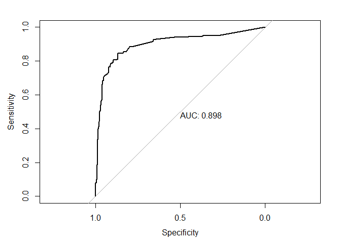<!-- -->

Obtem a predicao/probabilidade para cada observacao

``` r
Probabilidade <- predict(fit, newdata= dados,type = 'response')
```

Se a probabilidade for maior que 50% classifica como ‘Boa’

``` r
Classe_Predita <- ifelse(Probabilidade > 0.5,"Boa","Ruim")
```

Visualiza data frame com as predicoes

``` r
View(data.frame(dados,Probabilidade,Classe_Predita))
```

Gera matriz de confusao

``` r
confusao <- table(Classe_Predita = Classe_Predita, Classe_Original = relevel(dados$Classe,ref = 'Boa'))
confusao
```

    ##               Classe_Original
    ## Classe_Predita Boa Ruim
    ##           Boa  169   23
    ##           Ruim  72  435

Armazena valores da matriz de confusao

``` r
vp <- confusao[1,1];vp
```

    ## [1] 169

``` r
fn <- confusao[2,1];fn
```

    ## [1] 72

``` r
vn <- confusao[2,2];vn
```

    ## [1] 435

``` r
fp <- confusao[1,2];fp
```

    ## [1] 23

Calcula acuracia

``` r
acuracia <- sum(diag(confusao))/ sum(confusao);acuracia
```

    ## [1] 0.8640916

Calcula Sensitividade

``` r
sensitividade <- vp /(vp+fn)
sensitividade
```

    ## [1] 0.7012448

Cacula Especificidade

``` r
especificidade <- vn / (vn + fp) 
especificidade
```

    ## [1] 0.9497817

Analise de Sensitividade e Especificidade

(Todo o trecho de código abaixo não está funcionando perfeitamente e eu
não sei exatamente o porque. Está exatamente igual ao trecho usado pelo
professor na video aula. Se alguém tiver uma luz, eu agradeço!)

``` r
limiares <- sort(Probabilidade)
acuracia <- c()
sensitividade <- c()
especificidade <- c()

for ( i in 1:length(limiares)) {
  limiar_atual <- limiares[i]
  Classe_Predita <- ifelse(Probabilidade > limiar_atual, 'Boa', 'Ruim')

#Gera matriz de confusao
  confusao <- table(Classe_Predita = Classe_Predita, Classe_Original = relevel(dados$Classe, ref = 'Boa'))
}
confusao
```

    ##               Classe_Original
    ## Classe_Predita Boa Ruim
    ##           Ruim 241  458

Armazena valores da matriz de confusao (sinceramente não sei qual é o
erro nesse trecho. por causa dele, os próximos trechos ficarão
diferentes do que o professor utilizou em aula)

``` r
vp <- confusao[1,1];vp
```

    ## [1] 241

``` r
#fn <- confusao[2,1];fn
#vn <- confusao[2,2];vn
fp <- confusao[1,2];fp
```

    ## [1] 458

Calcula acuracia

``` r
acuracia[i] <- sum(diag(confusao))/ sum(confusao);
```

Calcula Sensitividade

``` r
sensitividade[i] <- vp /(vp+fn)
```

Calcula Especificidade

``` r
especificidade[i] <- vn / (vn + fp) 
```

Teoricamente, deveria mostrar o gráfico, mas não funciona

    plot(y = sensitividade[1:698] , x = limiares[1:698], type="l", col="red", ylab =
    'Sensitividade e Especificidade', xlab= 'Pontos de Corte')
    grid()

    lines(y = especificidade[1:698], x = limiares[1:698], type = 'l',col="blue" )
    legend("bottomleft", c("sensibilidade","especificidade"),
     col=c("red","blue"), lty=c(1,1),bty="n", cex=1, lwd=1)
    abline(v=0.225)

Obtem novamente as probabilidades para classificar baseado no ponto de
corte 22,5%

``` r
Probabilidade <- predict(fit, newdata= dados,type = 'response')
Classe_Predita <- ifelse(Probabilidade > 0.225,"Boa","Ruim")
View(data.frame(dados,Probabilidade,Classe_Predita))
```

Visualiza matriz de confusao final

``` r
confusao <- table(Classe_Predita = Classe_Predita, Classe_Original =
relevel(dados$Classe,ref = 'Boa'))
```

Armazena valores da matriz de confusao

``` r
vp <- confusao[1,1];vp
```

    ## [1] 204

``` r
fn <- confusao[2,1];fn
```

    ## [1] 37

``` r
vn <- confusao[2,2];vn
```

    ## [1] 383

``` r
fp <- confusao[1,2];fp
```

    ## [1] 75

Calculando acuracia, sensitividade e especificidade

``` r
#Calcula acuracia
acuracia <- sum(diag(confusao))/ sum(confusao);acuracia
```

    ## [1] 0.8397711

``` r
#Calcula Sensitividade
sensitividade <- vp /(vp+fn)
#Cacula Especificidade
especificidade <- vn / (vn + fp)
```

# Atividade Avaliativa do Módulo 01

## Enunciado:

**Uma empresa que trabalha com aluguel de veículos deseja estudar
algumas variáveis que eles suspeitam que influenciam no preço do aluguel
do veículo. Para confirmar essas suspeitas, foi reunido em um conjunto
dados um histórico contendo vinte locações que foram exportadas
aleatoriamente do banco de dados, ou seja, temos vinte observações.**

Foram selecionadas sete variáveis para este estudo:

▪ **Preço** (variável contínua medida em reais) – É a variável resposta,
nos diz qual foi o preço daquela locação.

▪ **Portas** (variável categórica com dois níveis) – Nos informa se o
veículo alugado era de duas portas ou quatro portas.

▪ **Ar Condicionado** (variável categórica com dois níveis) – Nos
informa se o veículo alugado tinha ar-condicionado ou não.

▪ **Quadrimestre** (variável categórica com três níveis) – Informa se
aquela locação ocorreu no primeiro, segundo ou terceiro quadrimestre do
ano.

▪ **Idade do Locatário** (variável discreta medida em anos) – Nos
informa qual a idade do indivíduo que realizou a locação.

▪ **Quilometragem** (variável contínua medida em KM) – Nos informa
quantos KM rodados o veículo tinha no ato da locação.

▪ **Dólar** (variável contínua medida em dólares) – Nos informa qual a
cotação do dólar no dia da locação.

Os alunos deverão desenvolver a prática e, depois, responder às questões
objetivas propostas.

### Criação do Data Frame a ser utilizado no processo

Forma o conjunto de dados historico contendo vinte locacoes sorteadas
aleatoriamente do banco de dados e a armazena em um data frame chamado
dados:

``` r
dados <- data.frame(
Preco = c(368.384514890573, 446.850186825816, 
          414.72765691978, 434.291090918223, 436.652686535348, 457.65797344255, 
          490.694346597566, 474.881781399868, 458.462395897205, 412.719412673294, 
          448.799032112411, 352.040747235864, 449.461858221104, 416.150953927119, 
          416.499426750268, 551.315803331779, 462.126789471159, 515.957335395508, 
          467.598697162974, 339.548470369391), 
Portas = c("duas_portas", "quatro_portas", "duas_portas", "quatro_portas", "quatro_portas", 
          "duas_portas", "quatro_portas", "duas_portas", "quatro_portas", 
          "duas_portas", "quatro_portas", "quatro_portas", "duas_portas", 
          "quatro_portas", "duas_portas", "quatro_portas", "quatro_portas", 
          "duas_portas", "quatro_portas", "quatro_portas"),
Ar_Condicionado = c("sem_ar_condicionado",  "com_ar_condicionado", "com_ar_condicionado", "com_ar_condicionado", 
                  "com_ar_condicionado", "com_ar_condicionado", "com_ar_condicionado", 
                  "com_ar_condicionado", "com_ar_condicionado", "com_ar_condicionado", 
                  "com_ar_condicionado", "sem_ar_condicionado", "com_ar_condicionado", 
                  "com_ar_condicionado", "com_ar_condicionado", "com_ar_condicionado", 
                  "com_ar_condicionado", "com_ar_condicionado", "com_ar_condicionado", 
                  "sem_ar_condicionado"),
Quadrimestre = c("segundo_quadrimestre","segundo_quadrimestre", "segundo_quadrimestre", "segundo_quadrimestre", 
                 "segundo_quadrimestre", "terceiro_quadrimestre", "primeiro_quadrimestre", 
                 "primeiro_quadrimestre", "terceiro_quadrimestre", "segundo_quadrimestre", 
                 "terceiro_quadrimestre", "segundo_quadrimestre", "terceiro_quadrimestre", 
                 "segundo_quadrimestre", "segundo_quadrimestre", "primeiro_quadrimestre", 
                 "terceiro_quadrimestre", "primeiro_quadrimestre", "primeiro_quadrimestre", 
                 "segundo_quadrimestre"), 
Idade_Locatario = c(23, 18, 28, 21, 18, 21, 18, 20, 25, 29, 18, 33, 20, 21, 18, 21, 18, 20, 25, 29),
Quilometragem = c(957.442780544097, 829.533278217768, 923.300215829467, 871.519116905113, 930.704105677958, 554.696695914233, 501.941059782271, 
                  665.435074822519, 568.24079543466, 930.704105677958, 554.696695914233, 
                  829.533278217768, 665.435074822519, 871.519116905113, 930.704105677958, 
                  351.547138218644, 501.941059782271, 447.872006186523, 568.24079543466, 
                  930.704105677958), 
Dolar = c(4.41147933990862, 5.63014407874318, 
         8.80557934010615, 4.260591319988649, 6.93416279643155, 1.61130694543154, 
         2.57813244655973, 4.66666728709914, 1.6846066723224, 7.33872353619711, 
         4.52300814589177, 2.96689816205009, 9.91448182957733, 8.55577847959413, 
         5.93424935955983, 5.55775429484673, 6.94475470863839, 4.74330294976712, 
         4.723306965757987, 4.7010894862212))

View(dados)
```

### Pergunta 01: Explore a variável resposta PREÇO e responda: Pelo histograma, você diria que a variável PREÇO segue uma distribuição normal?

1.  Não, pois o histograma apresenta comportamento assimétrico a
    direita.
2.  Não, pois os dados são distribuídos simetricamente.
3.  Não, pois o histograma apresenta comportamento assimétrico a
    esquerda.
4.  Sim, pela análise gráfica a variável preço aparenta seguir uma
    distribuição normal, pois os dados são distribuídos simetricamente
    em torno de um valor central.

``` r
hist(dados$Preco)
```

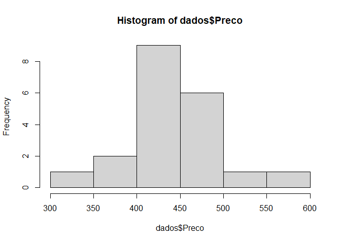<!-- -->

### Pergunta 02: Explore a variável resposta, que é o Preço, e responda: Pelo boxplot do Preço, você consegue visualizar algum outlier?

1.  Não há outlier, pois todos os valores estão entre a média e dois
    desvios padrões.
2.  Não há nenhum outlier, pois todos os valores estão entre o primeiro
    e o terceiro quartil.
3.  Não há nenhum outlier, pois todos os valores são próximos à mediana.
4.  Sim, possui um outlier superior e um inferior, ou seja, existe uma
    locação que o preço foi muito acima do esperado e uma locação cujo
    preço foi muito abaixo do esperado. Antes de remover estes outliers
    de uma análise, eles devem ser investigados sobre o que ocorreu
    naquelas locações que fez com o que o valor fosse tão discrepante da
    distribuição da variável.

``` r
boxplot(dados$Preco)
```

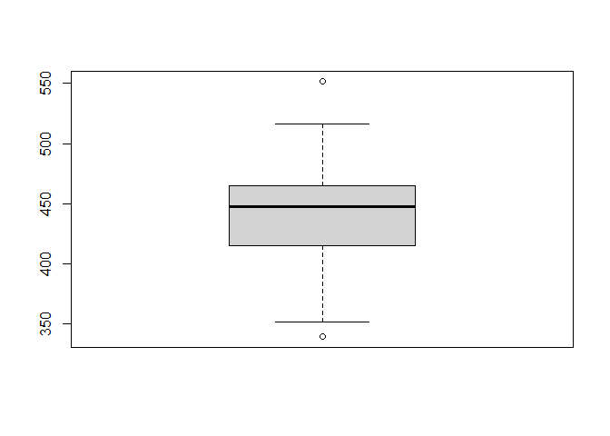<!-- -->

### Pergunta 03: Explore a variável resposta, que é o Preço, e responda: Qual é o valor mediano do Preço e qual a sua interpretação CORRETA?

1.  A mediana é 447,8. Isso nos diz que 50% dos preços são até este
    valor e os demais 50% são acima deste valor.
2.  A mediana é 447,8. Isso nos diz que 75% dos preços são até este
    valor e os demais 25% são acima deste valor.
3.  A mediana é 447,8. Isso nos diz que 25% dos preços são até este
    valor e os demais 75% são acima deste valor.
4.  A mediana é 447,8. Isso nos diz que o preço médio é 447,8

``` r
summary(dados$Preco)
```

    ##    Min. 1st Qu.  Median    Mean 3rd Qu.    Max. 
    ##   339.5   415.8   447.8   440.7   463.5   551.3

### Pergunta 04: Explore a relação entre as variáveis Preço e Quadrimestre, e responda: Através do boxplot, como o Preço se comporta em relação a cada Quadrimestre?

1.  O segundo quadrimestre apresenta a maior mediana.
2.  A três medianas estão perfeitamente alinhadas e são iguais.
3.  O primeiro quadrimestre apresenta a maior mediana.
4.  O terceiro quadrimestre apresenta a maior mediana.

``` r
boxplot(dados$Preco~ dados$Quadrimestre)
```

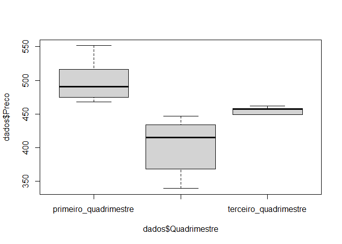<!-- -->

### Pergunta 05: Explore a relação entre as variáveis Preço e Quadrimestre, e responda: Através de uma ANOVA, existe diferença significativa entre o Preço médio de pelo menos um Quadrimestre em relação aos outros? Como chegou a essa conclusão? Adote 95% de confiança na sua interpretação.

1.  Não, pois o F Value é maior que 0,05.
2.  Sim, considerando o alfa de 0,05 e ao p valor de 0,000126, há
    evidências para rejeitar a hipótese nula de igualdade de médias, ou
    seja, pelo menos um dos quadrimestres possui o preço médio diferente
    dos demais.
3.  Não, pois os graus de liberdade residuais deram 17, ou seja, maior
    que 0,05.
4.  Não, pois a média quadrática dos resíduos é 1014, ou seja, maior que
    0,05.

``` r
anova <- aov(Preco ~ Quadrimestre, data = dados)
summary(anova)
```

    ##              Df Sum Sq Mean Sq F value   Pr(>F)    
    ## Quadrimestre  2  32328   16164   15.95 0.000126 ***
    ## Residuals    17  17230    1014                     
    ## ---
    ## Signif. codes:  0 '***' 0.001 '**' 0.01 '*' 0.05 '.' 0.1 ' ' 1

### Pergunta 06: Explore a relação entre as variáveis Preço e Portas, e responda: Através de um teste t de Student para amostras independentes, existe diferença significativa entre o preço médio do aluguel do veículo com duas portas quando comparado com o preço médio do veículo de quatro portas? Adote 95% de confiança ao realizar na sua interpretação.

1.  Sim, pois as medianas não são iguais.
2.  Sim, pois os desvios padrões não são iguais.
3.  Não, pois ao p valor de 0,8884 não há evidências para rejeitar a
    hipótese nula de igualdade de médias, ou seja, não há diferença
    significativa entre o preço médio de veículos de duas portas em
    relação ao preço médio de veículos de quatro portas.
4.  Sim, pois o preço médio dos veículos de duas portas é 438,78 e o
    preço médio dos veículos de quatro portas é de 442,04.

``` r
boxplot(dados$Preco ~ dados$Portas)
```

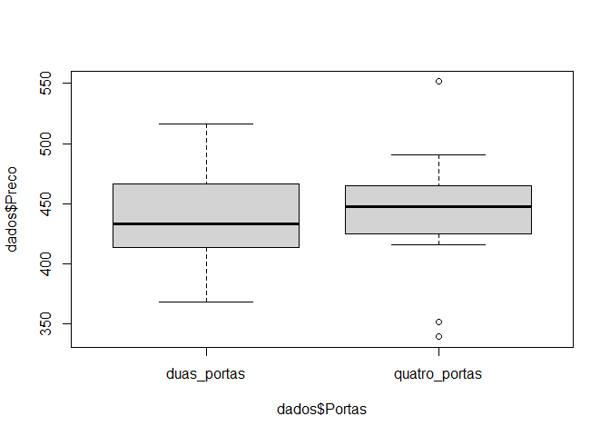<!-- -->

``` r
#Test t de Student
t.test(dados$Preco ~ dados$Portas , 
       paired = FALSE, #amostras nao pareadas
       alternative = 'two.sided', #bilateral
       conf.level = 0.95 #95% de confianca
       )
```

    ## 
    ##  Welch Two Sample t-test
    ## 
    ## data:  dados$Preco by dados$Portas
    ## t = -0.14239, df = 17.221, p-value = 0.8884
    ## alternative hypothesis: true difference in means between group duas_portas and group quatro_portas is not equal to 0
    ## 95 percent confidence interval:
    ##  -51.48432  44.96827
    ## sample estimates:
    ##   mean in group duas_portas mean in group quatro_portas 
    ##                    438.7862                    442.0443

### Pergunta 07: Explore a relação entre as variáveis Preço e Quilometragem, e responda: Pelo gráfico de dispersão, você identifica que existe relação linear entre o Preço e a Quilometragem? Se sim, a relação é positiva ou negativa?

1.  Existe relação, mas é uma relação quadrática.
2.  Sim, a relação é linear negativa, pois à medida que a quilometragem
    aumenta o preço diminui.
3.  Não existe relação entre as duas variáveis.
4.  Sim, a relação é positiva.

``` r
plot(y = dados$Preco ,
     x = dados$Quilometragem,
     pch = 16)
```

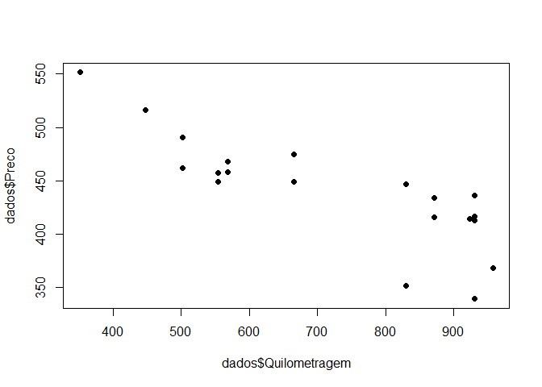<!-- -->

### Pergunta 08: Explore a relação entre as variáveis Preço e Quilometragem, e responda: Obtenha o valor do coeficiente de correlação linear de Pearson entre o Preço e a Quilometragem. Qual a interpretação CORRETA?

1.  O coeficiente de correlação linear de Pearson é -0,82, isso nos
    informa que é uma correlação negativa alta.
2.  O coeficiente de correlação linear de Pearson é -0,82, isso nos
    informa que é uma correlação negativa baixa.
3.  O coeficiente de correlação linear de Pearson é -0,82, isso nos
    informa que é uma correlação positiva alta.
4.  O coeficiente de correlação linear de Pearson é -0,82, isso nos
    informa que não há correlação.

``` r
cor(dados$Preco, dados$Quilometragem)
```

    ## [1] -0.8231561

### Pergunta 09: Explore a relação entre as variáveis Preço e Quilometragem, e responda: Se tentarmos utilizar somente a Quilometragem para prever o valor do Preço, o quanto da variação do Preço a variável Quilometragem consegue explicar? Em outas palavras, interprete o R2 da regressão linear do Preço em função da Quilometragem.

1.  O R2 é de 67,76%, ou seja, a variável Quilometragem consegue
    explicar 67,76% da variação do Preço.
2.  O R2 é de 67,76%, ou seja, para cada quilometro aumentado, o Preço
    aumenta em média 67,76%.
3.  O R2 é de 67,76%, ou seja, para cada quilometro aumentado, o Preço
    diminui em média 67,76%.
4.  O R2 é de 67,76%, ou seja, para cada quilometro aumentado, o Preço
    aumenta em média 32,24% (1-0,6776).

``` r
regressao_linear <- lm(Preco ~ Quilometragem, data = dados)
summary(regressao_linear)
```

    ## 
    ## Call:
    ## lm(formula = Preco ~ Quilometragem, data = dados)
    ## 
    ## Residuals:
    ##     Min      1Q  Median      3Q     Max 
    ## -65.477 -18.862   5.824  20.919  40.446 
    ## 
    ## Coefficients:
    ##                Estimate Std. Error t value Pr(>|t|)    
    ## (Intercept)   592.25689   25.51961  23.208 7.28e-15 ***
    ## Quilometragem  -0.21065    0.03425  -6.151 8.29e-06 ***
    ## ---
    ## Signif. codes:  0 '***' 0.001 '**' 0.01 '*' 0.05 '.' 0.1 ' ' 1
    ## 
    ## Residual standard error: 29.79 on 18 degrees of freedom
    ## Multiple R-squared:  0.6776, Adjusted R-squared:  0.6597 
    ## F-statistic: 37.83 on 1 and 18 DF,  p-value: 8.293e-06

### Pergunta 10: Explore a variável Quilometragem, e responda: Qual o valor do primeiro quartil e qual a sua interpretação CORRETA?

1.  O primeiro quartil é 747,5, isso nos diz que até 25% dos veículos
    alugados possuem quilometragem até 554,7.
2.  O primeiro quartil é 554,7, isso nos diz que até 50% dos veículos
    alugados possuem quilometragem até 554,7.
3.  O primeiro quartil é 554,7, isso nos diz que até 75% dos veículos
    alugados possuem quilometragem até 554,7.
4.  O primeiro quartil é 554,7, isso nos diz que até 25% dos veículos
    alugados possuem quilometragem até 554,7.

``` r
summary(dados$Quilometragem)
```

    ##    Min. 1st Qu.  Median    Mean 3rd Qu.    Max. 
    ##   351.5   554.7   747.5   719.3   925.2   957.4

### Pergunta 11: Explore a variável Quilometragem, e responda: Qual o valor do terceiro quartil e qual a sua interpretação CORRETA?

1.  O terceiro quartil é 925,2, isso nos diz que até 50% dos veículos
    alugados possuem quilometragem até 925,2.
2.  O terceiro quartil é 925,2, isso nos diz que até 25% dos veículos
    alugados possuem quilometragem até 925,2.
3.  O terceiro quartil é 925,2, isso nos diz que até 75% dos veículos
    alugados possuem quilometragem até 925,2.
4.  O terceiro quartil é 925,2, isso nos diz que até 75% dos veículos
    alugados possuem quilometragem até 719,3.

``` r
summary(dados$Quilometragem)
```

    ##    Min. 1st Qu.  Median    Mean 3rd Qu.    Max. 
    ##   351.5   554.7   747.5   719.3   925.2   957.4

### Pergunta 12: Explore a variável Quilometragem e responda: Qual é o valor do coeficiente de variação e qual a sua interpretação CORRETA?

1.  O coeficiente de variação é 27,74%, ou seja, os valores da variável
    quilometragem variam em média 27,74% em torno de sua média.
2.  O coeficiente de variação é 27,74%, ou seja, os valores da variável
    quilometragem variam em média 27,74% em torno do terceiro quartil.
3.  O coeficiente de variação é 27,74%, ou seja, os valores da variável
    quilometragem variam em média 27,74% em torno do desvio padrão.
4.  O coeficiente de variação é 27,74%, ou seja, os valores da variável
    quilometragem variam em média 27,74% em torno do primeiro quartil.

``` r
sd(dados$Quilometragem) / mean(dados$Quilometragem)
```

    ## [1] 0.2774628

### Pergunta 13: Explore a correlação entre o Dolar e o Preco, e responda: A correlação entre as duas variáveis é positiva ou negativa?

1.  A correlação é negativa.
2.  A correlação é positiva.
3.  Existe uma correlação cúbica.
4.  O gráfico de dispersão não apresenta nenhum padrão entre as duas
    variáveis, ou seja, na medida que o Dólar aumenta, o Preço não
    cresce nem decresce, ou seja, não há correlação entre as duas
    variáveis.

``` r
plot(y = dados$Preco,
     x = dados$Dolar,
     pch = 16)
```

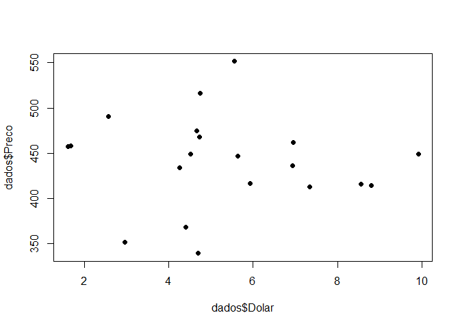<!-- -->

### Pergunta 14: Explore a correlação entre o Dolar e o Preco, e responda: Obtenha o coeficiente de correlação linear de Pearson entre o Dolar e o Preço. Qual a interpretação CORRETA?

1.  O valor do coeficiente de correlação linear de Pearson é -0,06, o
    que indica correlação positiva fraca.
2.  O valor do coeficiente de correlação linear de Pearson é -0,06, o
    que indica correlação negativa forte.
3.  O valor do coeficiente de correlação linear de Pearson é -0,06, que
    indica ausência de correlação linear.
4.  O valor do coeficiente de correlação linear de Pearson é -0,06, o
    que indica correlação negativa moderada.

``` r
cor(dados$Preco, dados$Dolar)
```

    ## [1] -0.06982716

### Pergunta 15: Explore a correlação entre o Dolar e o Preco, e responda: Se ajustarmos uma regressão linear entre o Dolar e o Preco, para tentar prever o Preço baseado no Dólar, seria possível?

1.  Seria possível, pois a estatística F é menor que 5%.
2.  Seria possível, pois o p valor do coeficiente beta do Dolar é acima
    de 5%.
3.  Seria possível, pois o valor do coeficiente beta é negativo -1,573.
4.  Não seria possível, pois o p valor do coeficiente beta do Dolar é de
    0,77 (77%), ou seja, independente do nível de significância adotado,
    a variável Dolar não exerce influência significativa na variável
    Preco, portanto, não é possível prever o Preço baseado no Dólar.

``` r
regressao_linear <- lm(Preco ~ Dolar, data = dados)
summary(regressao_linear)
```

    ## 
    ## Call:
    ## lm(formula = Preco ~ Dolar, data = dados)
    ## 
    ## Residuals:
    ##      Min       1Q   Median       3Q      Max 
    ## -102.173  -21.224    6.694   24.429  110.942 
    ## 
    ## Coefficients:
    ##             Estimate Std. Error t value Pr(>|t|)    
    ## (Intercept)  449.115     30.530  14.711 1.78e-11 ***
    ## Dolar         -1.573      5.296  -0.297     0.77    
    ## ---
    ## Signif. codes:  0 '***' 0.001 '**' 0.01 '*' 0.05 '.' 0.1 ' ' 1
    ## 
    ## Residual standard error: 52.34 on 18 degrees of freedom
    ## Multiple R-squared:  0.004876,   Adjusted R-squared:  -0.05041 
    ## F-statistic: 0.08819 on 1 and 18 DF,  p-value: 0.7699
