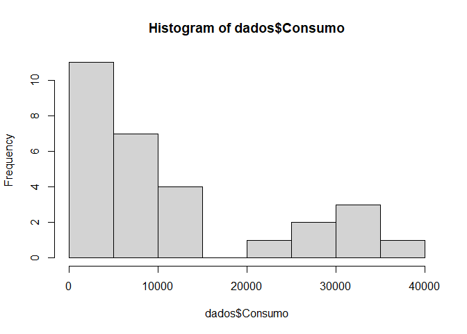
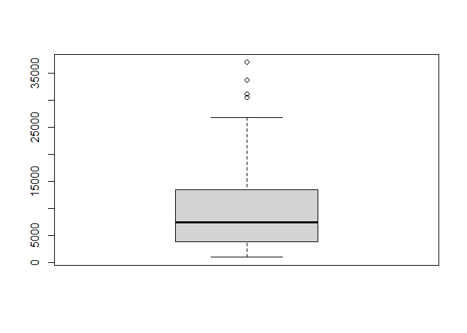
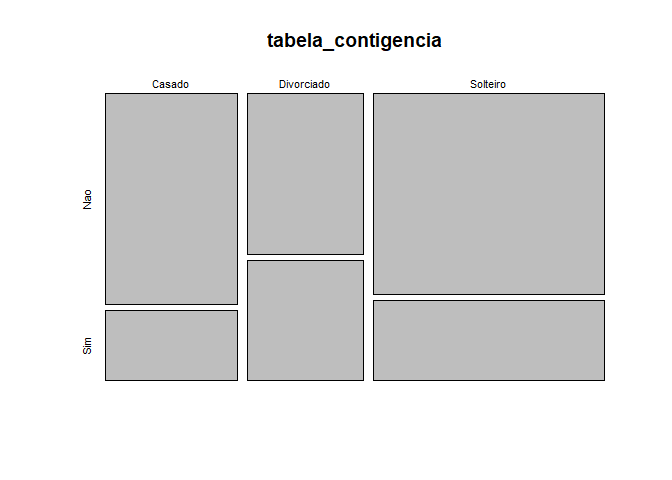
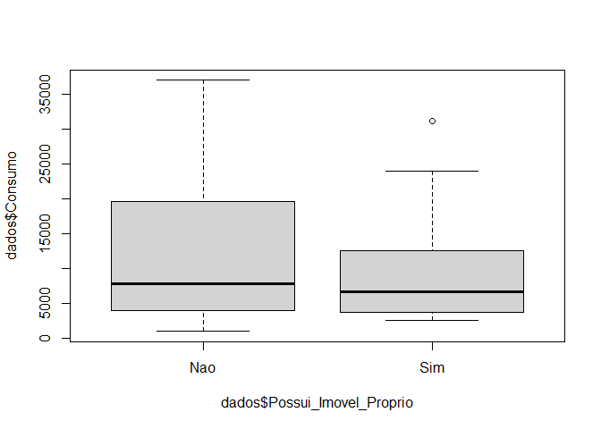
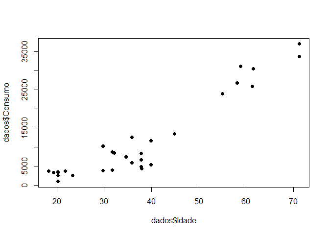
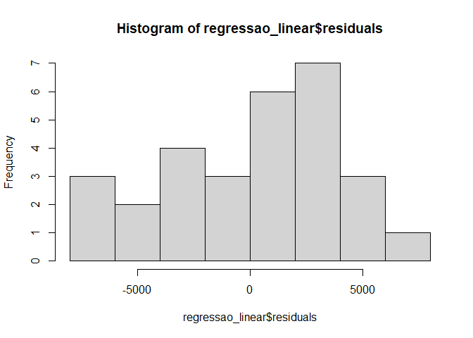

Desafio - Modulo 01
================

# Desafio - Módulo 01

## Enunciado:

Uma empresa que trabalha com vendas em um e-commerce deseja estudar
quais características (variáveis) dos seus clientes que impactam no
consumo, ou seja, as variáveis que têm relação ao quanto o cliente
consome (compra). Para este objetivo, foram selecionados aleatoriamente
29 clientes do banco de dados. Foram selecionadas seis variáveis para
este estudo:

▪ Consumo (variável contínua medida em reais) – É a variável resposta,
nos diz qual foi o consumo de cada cliente ▪ Estado Civil (variável
categórica com três níveis) – Nos informa se o cliente é Casado,
Divorciado ou Solteiro. ▪ Gênero (variável categórica com dois níveis) –
Nos informa se o cliente faz parte do público masculino ou do público
feminino. ▪ Idade (variável discreta medida em anos) – Nos informa a
idade do cliente. ▪ Renda Mensal (variável contínua medida em reais) –
Nos informa a renda mensal do cliente. ▪ Possui Imóvel Próprio (variável
categórica com dois níveis) – Nos informa se cliente possui imóvel
próprio ou não.

``` r
dados <- data.frame(
  Consumo = c(2595, 8470, 4007, 6734, 33628, 3903, 
              13444, 12560, 31176, 5435, 26736, 3728, 8684, 8356, 36936, 3744, 
              30420, 5958, 1019, 11688, 4442, 2640, 23888, 25844, 7430, 10276, 
              3381, 3512, 4957),
  Estado_Civil = c("Divorciado", "Casado", "Divorciado", 
                   "Casado", "Solteiro", "Divorciado", "Solteiro", "Solteiro", "Solteiro", 
                   "Casado", "Solteiro", "Divorciado", "Solteiro", "Solteiro", "Solteiro", 
                   "Divorciado", "Solteiro", "Divorciado", "Divorciado", "Solteiro", 
                   "Casado", "Solteiro", "Solteiro", "Solteiro", "Casado", "Solteiro", 
                   "Casado", "Casado", "Casado"), 
  Genero = c("Feminino", "Feminino", 
             "Masculino", "Feminino", "Feminino", "Feminino", "Feminino", 
             "Feminino", "Feminino", "Masculino", "Masculino", "Masculino", 
             "Feminino", "Feminino", "Masculino", "Masculino", "Feminino", 
             "Masculino", "Feminino", "Feminino", "Masculino", "Masculino", 
             "Masculino", "Masculino", "Masculino", "Feminino", "Feminino", 
             "Masculino", "Feminino"), 
  Idade = c(20.2585750236176, 32.1118436595569, 
            31.7467633607352, 37.8198500301827, 71.2083039792698, 29.7176362875943, 
            44.8093915220787, 35.8376118862763, 58.8385574663313, 39.9177951271474, 
            58.0550560477448, 21.778210059274, 31.7467633607352, 37.8198500301827, 
            71.2083039792698, 18.2385329827666, 61.5387187691615, 35.8376118862763, 
            20.2585750236176, 39.9177951271474, 37.9148802474609, 23.3568492662162, 
            54.9958059606044, 61.2973920327649, 34.58738731516, 29.7176362875943, 
            19.2584996796213, 20.2585750236176, 37.8080561311484), 
  Renda_Mensal = c(1985.88181437971,3769.2479179441, 2291.88059431382, 2390.40280655742, 8534.7173298783, 
                   2495.88975635737, 5714.55454591117, 5832.6343267674, 6882.89867212748, 
                   2099.31900110052, 6342.50934129081, 1941.14793399086, 3575.98064224822, 
                   3589.23716442208, 8534.7173298783, 2740.46957610393, 5714.55454591117, 
                   2390.40280655742, 1635.64603350165, 4364.56455252666, 1905.53820715893, 
                   2338.3086884437, 5832.6343267674, 6882.89867212748, 3842.53578942318, 
                   4919.14670791015, 2063.01440787432, 2380.55793401061, 1985.88181437971),
  Possui_Imovel_Proprio = c("Sim", "Sim", "Nao", "Sim", "Nao", 
                            "Nao", "Nao", "Sim", "Sim", "Nao", "Nao", "Nao", "Nao", "Nao", 
                            "Nao", "Sim", "Nao", "Sim", "Nao", "Nao", "Nao", "Sim", "Sim", 
                            "Nao", "Nao", "Nao", "Nao", "Nao", "Nao")
)

View(dados)
```

## Pergunta 01 - Explore a variável resposta, que é o Consumo, e responda:

Pelo histograma, você diria que a variável segue uma distribuição
normal?

1.  Sim, pois os dados são distribuídos simetricamente em torno do
    desvio padrão.
2.  Sim, pois os dados se concentram entre a mediana e o terceiro
    quartil.
3.  Sim, pois os dados se concentram entre o primeiro quartil e a
    mediana.
4.  Não, pois os dados não são distribuídos simetricamente em torno de
    um valor central.

Histograma do consumo:

``` r
hist(dados$Consumo)
```

<!-- -->

## Pergunta 02 - Explore a variável resposta, que é o Consumo, e responda:

Pelo boxplot, você consegue visualizar algum outlier?

1.  Não, pois há somente 4 pontos acima do limite superior.
2.  Sim, há pontos outliers tanto acima do limite superior quanto do
    limite inferior.
3.  Sim, há pontos outliers acima do limite superior.
4.  Não, pois apesar de ter pontos acima do limite superior, também
    deveria ter abaixo do limite inferior para se considerar outlier.

Boxplot do consumo:

``` r
boxplot(dados$Consumo)
```

<!-- -->

## Pergunta 03 - Explore a variável resposta, que é o Consumo, e responda:

Qual é o valor do primeiro quartil e terceiro quartil?

1.  Pelo fato de a variável não seguir uma distribuição normal, não é
    possível calcular o primeiro e o terceiro quartil.
2.  Os valores do primeiro e terceiro quartil são 3903 e 13444,
    respectivamente, significa que 25% dos clientes consomem até 3903 e
    75% dos clientes consomem até 13444.
3.  Os valores do primeiro e terceiro quartil são 1019 e 7430,
    respectivamente, significa que 25% dos clientes consomem até 1019 e
    75% dos clientes consomem até 7430.
4.  Os valores do primeiro e terceiro quartil são 7430 e 36936,
    respectivamente, significa que 25% dos clientes consomem até 7430 e
    75% dos clientes consomem até 36936

Estatisticas descritivas do consumo

``` r
summary(dados$Consumo)
```

    ##    Min. 1st Qu.  Median    Mean 3rd Qu.    Max. 
    ##    1019    3903    7430   11917   13444   36936

## Pergunta 04 - Suspeita-se que a variável Estado Civil está associada com o fato de o cliente Possuir Imóvel Próprio. Investigue a relação entre essas duas variáveis e responda:

Através do teste qui-quadrado, existe relação significativa entre o
Estado Civil e o fato do cliente Possuir Imóvel Próprio? Justifique sua
resposta. Adote 90% de confiança ao realizar suas interpretações.

1.  O qui-quadrado calculado foi de 0,6329, que é abaixo de 0,90,
    portanto, há evidências para rejeitar a hipótese nula.
2.  Os graus de liberdade (df) foram de dois, e não é possível realizar
    um teste qui-quadrado com dois graus de liberdade, portanto, a
    resposta é inconclusiva.
3.  Ao p valor de 72,87%, não há evidências para rejeitar a hipótese
    nula de independência entre as variáveis, ou seja, o Estado Civil
    não tem associação significativa com o fato de o cliente ter ou não
    ter Imóvel Próprio.
4.  Ao p valor de 72,87%, há evidências para rejeitar a hipótese nula de
    independência entre as variáveis, ou seja, o Estado Civil possui
    associação significativa com o fato de o cliente ter ou não ter
    Imóvel Próprio.

Gera tabela de contigencia entre Estado Civil e Possui Imovel Proprio

``` r
tabela_contigencia <- table(dados$Estado_Civil, dados$Possui_Imovel_Proprio)

tabela_contigencia
```

    ##             
    ##              Nao Sim
    ##   Casado       6   2
    ##   Divorciado   4   3
    ##   Solteiro    10   4

``` r
plot(tabela_contigencia)
```

<!-- -->

Realiza teste qui-quadrado

``` r
chisq.test(tabela_contigencia) #ignore a mensagem de warning de vermelho
```

    ## Warning in chisq.test(tabela_contigencia): Chi-squared approximation may be
    ## incorrect

    ## 
    ##  Pearson's Chi-squared test
    ## 
    ## data:  tabela_contigencia
    ## X-squared = 0.63294, df = 2, p-value = 0.7287

## Pergunta 05 - Explore a relação entre as variáveis Consumo e Possui Imóvel Próprio, e responda:

Através de um teste t de Student para amostras independentes, existe
diferença significativa entre o consumo médio do público que possui
imóvel próprio quando comparado com o consumo médio do público não
possui imóvel próprio? Adote 95% de confiança ao realizar suas
interpretações.

1.  Com 17.47 graus de liberdade, temos evidências para rejeitar a
    hipótese nula de igualdade de médias, ou seja, o consumo de quem tem
    imóvel próprio é estatisticamente diferente do consumo de quem não
    tem imóvel próprio.
2.  Ao p valor de 72,26%, há evidências para rejeitar a hipótese nula de
    igualdade de médias, ou seja, a média do consumo de quem tem imóvel
    próprio é estatisticamente diferente da média de consumo de quem não
    tem imóvel próprio.
3.  Ao p valor de 72,26%, não há evidências para rejeitar a hipótese
    nula de igualdade de médias, ou seja, a média do consumo de quem tem
    imóvel próprio não é estatisticamente diferente da média de consumo
    de quem não tem imóvel próprio.
4.  É estatisticamente diferente, pois o consumo médio de quem não tem
    imóvel próprio é de 12391,3 e quem tem imóvel próprio é de 10862,78.

``` r
boxplot(dados$Consumo ~ dados$Possui_Imovel_Proprio)
```

<!-- -->

Teste t

``` r
#Test t de Student
t.test(dados$Consumo ~ dados$Possui_Imovel_Proprio , 
       paired = FALSE, #amostras nao pareadas
       alternative = 'two.sided', #bilateral
       conf.level = 0.95 #95% de confianca
)
```

    ## 
    ##  Welch Two Sample t-test
    ## 
    ## data:  dados$Consumo by dados$Possui_Imovel_Proprio
    ## t = 0.3608, df = 17.472, p-value = 0.7226
    ## alternative hypothesis: true difference in means between group Nao and group Sim is not equal to 0
    ## 95 percent confidence interval:
    ##  -7391.322 10448.367
    ## sample estimates:
    ## mean in group Nao mean in group Sim 
    ##          12391.30          10862.78

## Pergunta 06 - Explore a relação entre as variáveis Consumo e Idade, e responda:

Pelo gráfico de dispersão, você identifica que existe relação linear
entre o Consumo e a Idade? Se sim, a relação é positiva ou negativa?

1.  Sim, existe uma correlação linear positiva, pois à medida que a
    idade aumenta o consumo também aumenta.

2.  , existe uma correlação linear negativa, pois à medida que a idade
    aumenta o consumo também aumenta.

3.  Não existe correlação.

``` r
plot(y = dados$Consumo ,
     x = dados$Idade,
     pch = 16)
```

<!-- -->

## Pergunta 07 - Explore a relação entre as variáveis Consumo e Idade, e responda:

Obtenha o valor do coeficiente de correlação linear de Pearson entre o
Consumo e a Idade e interprete. Marque a alternativa CORRETA.

1.  O coeficiente de correlação linear de Pearson entre o Consumo e a
    Idade é de 0,93, que é uma correlação positiva forte.
2.  O coeficiente de correlação linear de Pearson entre o Consumo e a
    Idade é de 0,93, que é uma correlação negativa fraca.
3.  O coeficiente de correlação linear de Pearson entre o Consumo e a
    Idade é de 0,93, que é uma correlação positiva fraca.
4.  O coeficiente de correlação linear de Pearson entre o Consumo e a
    Idade é de 0,93, que é uma correlação negativa forte.

calculando a correlação:

``` r
cor(dados$Consumo, dados$Idade)
```

    ## [1] 0.939904

## Pergunta 08 - Explore a relação entre as variáveis Consumo e Idade, e responda:

Se tentarmos utilizar somente a Idade para prever o Consumo, o quanto da
variação do Consumo a variável Idade consegue explicar? Em outras
palavras, interpretar o R2 da regressão linear do Consumo em função da
Idade.

1.  O R2 é de 88,34%, ou seja, para cada aumento unitário na idade, o
    Consumo aumenta em média 11,66% (1-0,8834).
2.  O R2 é de 88,34%, ou seja, para cada aumento unitário na idade, o
    consumo diminui em média 88,34%.
3.  O R2 é de 88,34%, ou seja, a Idade consegue explicar 88,34% da
    variação do Consumo.
4.  O R2 é de 88,34%, ou seja, para cada aumento unitário na idade, o
    Consumo aumenta em média 88,34%.

Ajuste regressao linear do Consumo em funcao da Idade

``` r
regressao_linear <- lm(Consumo ~ Idade, data = dados)
summary(regressao_linear)
```

    ## 
    ## Call:
    ## lm(formula = Consumo ~ Idade, data = dados)
    ## 
    ## Residuals:
    ##     Min      1Q  Median      3Q     Max 
    ## -7376.9 -2561.4   754.3  2758.7  6011.5 
    ## 
    ## Coefficients:
    ##              Estimate Std. Error t value Pr(>|t|)    
    ## (Intercept) -13248.72    1895.14  -6.991 1.63e-07 ***
    ## Idade          652.86      45.64  14.304 4.04e-14 ***
    ## ---
    ## Signif. codes:  0 '***' 0.001 '**' 0.01 '*' 0.05 '.' 0.1 ' ' 1
    ## 
    ## Residual standard error: 3793 on 27 degrees of freedom
    ## Multiple R-squared:  0.8834, Adjusted R-squared:  0.8791 
    ## F-statistic: 204.6 on 1 and 27 DF,  p-value: 4.042e-14

## Pergunta 09 - Explore a relação entre as variáveis Consumo e Idade, e responda:

Execute um teste de normalidade para regressão linear entre Consumo e
Idade e, de acordo com os resultados, informe se os resíduos seguem ou
não seguem uma distribuição normal. Adote 95% de confiança.

1.  Ao p valor de 24,15%, há evidências para rejeitar a hipótese de
    normalidade, ou seja, os resíduos não seguem uma distribuição normal
2.  Ao p valor de 24,15%, só rejeitaríamos a hipótese de normalidade
    caso o nível de confiança fosse de 99%. Portanto o teste é
    inconclusivo.
3.  Ao p valor de 24,15%, só rejeitaríamos a hipótese de normalidade
    caso o nível de confiança fosse de 90%. Portanto o teste é
    inconclusivo.
4.  Ao p valor de 24,15%, não há evidências para rejeitar a hipótese de
    normalidade, ou seja, os resíduos seguem uma distribuição normal.

Teste de normalidade para os residuos da regressao

``` r
shapiro.test(regressao_linear$residuals)
```

    ## 
    ##  Shapiro-Wilk normality test
    ## 
    ## data:  regressao_linear$residuals
    ## W = 0.95467, p-value = 0.2415

``` r
hist(regressao_linear$residuals)
```

<!-- -->

## Pergunta 10 - Explore a variável Renda Mensal e responda:

Qual o valor do primeiro quartil e qual a sua interpretação CORRETA?

1.  O primeiro quartil é 2292, isso nos diz que 50% dos clientes têm
    renda mensal até 2292 e os outros 50% têm renda mensal acima desse
    valor
2.  O primeiro quartil é 3576, isso nos diz que 25% dos clientes têm
    renda mensal de até 3576.
3.  O primeiro quartil é 2292, isso nos diz que 75% dos clientes têm
    renda até 2292 e 25% têm renda acima desse valor.
4.  O primeiro quartil é 2292, isso nos diz que 25% dos clientes têm
    renda mensal de até 2292.

``` r
summary(dados$Renda_Mensal)
```

    ##    Min. 1st Qu.  Median    Mean 3rd Qu.    Max. 
    ##    1636    2292    3576    3965    5715    8535

## Pergunta 11 - Explore a variável Renda Mensal e responda:

Qual o valor da mediana e qual a sua interpretação CORRETA?

1.  O mediana é 3576, isso nos diz que 75% dos clientes têm renda até
    3576 e 25% têm renda acima desse valor.
2.  O valor da mediana é 3576, isso nos diz que 50% dos clientes têm
    renda até 3576 e os outros 50% têm renda maior que 3576.
3.  O valor da mediana é 3576, isso nos diz que o cliente que tem a
    maior renda possui renda de 3576.
4.  A mediana é 3576, isso nos diz que 25% dos clientes têm renda mensal
    de até 3576.

``` r
summary(dados$Renda_Mensal)
```

    ##    Min. 1st Qu.  Median    Mean 3rd Qu.    Max. 
    ##    1636    2292    3576    3965    5715    8535

## Pergunta 12 - Ajuste uma Regressão linear do Consumo em função da Idade e Renda Mensal, e responda:

O modelo de regressão linear ajustado é válido?

1.  Sim, pois p valor do teste F é aproximadamente zero, então há
    evidências para rejeitar a hipótese de que o modelo ajustado não é
    válido.
2.  Não, pois p valor do teste F é aproximadamente zero, então não há
    evidências para rejeitar a hipótese de que o modelo ajustado não é
    válido.
3.  Não, pois a estatística F obtida foi de 235,6 com apenas dois graus
    de liberdade no numerador e 26 no denominador.
4.  Não, pois não se pode ajustar uma regressão linear com apenas dois
    preditores.

``` r
regressao_linear <- lm(Consumo ~ Idade + Renda_Mensal, data = dados)
summary(regressao_linear)
```

    ## 
    ## Call:
    ## lm(formula = Consumo ~ Idade + Renda_Mensal, data = dados)
    ## 
    ## Residuals:
    ##     Min      1Q  Median      3Q     Max 
    ## -5245.5 -1653.1  -797.9  1787.4  5906.7 
    ## 
    ## Coefficients:
    ##                Estimate Std. Error t value Pr(>|t|)    
    ## (Intercept)  -1.191e+04  1.315e+03  -9.054 1.61e-09 ***
    ## Idade         3.481e+02  6.226e+01   5.591 7.11e-06 ***
    ## Renda_Mensal  2.625e+00  4.643e-01   5.653 6.05e-06 ***
    ## ---
    ## Signif. codes:  0 '***' 0.001 '**' 0.01 '*' 0.05 '.' 0.1 ' ' 1
    ## 
    ## Residual standard error: 2589 on 26 degrees of freedom
    ## Multiple R-squared:  0.9477, Adjusted R-squared:  0.9437 
    ## F-statistic: 235.6 on 2 and 26 DF,  p-value: < 2.2e-16

## Pergunta 13 - Ajuste uma Regressão linear do Consumo em função da Idade e Renda Mensal, e responda:

Marque a alternativa com a interpretação CORRETA do coeficiente Beta da
variável Idade.

1.  O coeficiente Beta da variável idade é de 3,48, isso nos diz que a
    idade explica 3,48% da variação do consumo.
2.  O coeficiente Beta da variável idade é de 3,48, isso nos diz que a
    idade não é uma variável significativa e deve ser removida do
    modelo.
3.  O coeficiente Beta da variável idade é de 3,48, ou seja, mantendo as
    demais variáveis constantes, a cada aumento unitário na idade, o
    consumo aumenta em média 3,48 unidades.
4.  O coeficiente Beta da variável idade é de 3,48, isso nos diz que
    teremos um coeficiente de correlação de Pearson de 0,48.

## Pergunta 14 - Ajuste uma Regressão linear do Consumo em função da Idade e Renda Mensal, e responda:

Marque a alternativa com a interpretação CORRETA do coeficiente Beta da
variável Renda Mensal.

1.  O coeficiente Beta da variável Renda Mensal é de 2,62, isso nos diz
    que teremos um coeficiente de correlação de Pearson de 0,62.
2.  O coeficiente Beta da variável idade é de 2,62, isso nos diz que a
    Renda Mensal explica 2,62% da variação do consumo.
3.  O coeficiente Beta da variável idade é de 2,62, isso nos diz que a
    Renda Mensal não é uma variável significativa e deve ser removida do
    modelo.
4.  O coeficiente Beta da variável Renda Mensal é de 2,62, ou seja,
    mantendo as demais variáveis constantes, a cada aumento unitário na
    Renda Mensal, o consumo aumenta, em média, 2,62 unidades.

## Pergunta 15 - Ajuste uma Regressão linear do Consumo em função da Idade e Renda Mensal, e responda:

Como os valores t são obtidos? (coluna t value)

1.  Dividindo a coluna Estimate pela coluna Pr(&gt;\|t\|).
2.  Elevando ao quadrado os valores da coluna Estimate.
3.  Tomando a raiz quadrado dos valores da coluna Estimate.
4.  Dividindo a coluna Estimate pela coluna Std. Error.
